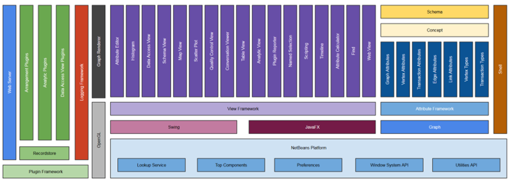

# Contributing to Constellation

First, thank you for taking the time to contribute! :+1:

We are happy to engage with the community and accept pull requests to
make Constellation the best it can be.

The following is a set of guidelines for contributing to Constellation
and its modules. These are not rules. Use your best judgment, and feel
free to propose changes to this document in a pull request.

#### Table of Contents

[Code of Conduct](#code-of-conduct)

[I don’t want to read this whole thing, I just have a
question!](#i-dont-want-to-read-this-whole-thing-i-just-have-a-question)

[What should I know before I get
started?](#what-should-i-know-before-i-get-started)

-   [Constellation Core](#constellation-core)

-   [Constellation Modules and
Repositories](#constellation-modules-and-repositories)

-   [Design Decisions](#design-decisions)

[How Can I Contribute?](#how-can-i-contribute)

-   [Reporting Bugs](#reporting-bugs)

-   [Suggesting Enhancements](#suggesting-enhancements)

-   [Your First Code Contribution](#your-first-code-contribution)

-   [Pull Requests](#pull-requests)

[Style Guides](STYLE_GUIDELINES.md)

-   [Git Commit Messages](#git-commit-messages)

## Code of Conduct

This project and everyone participating in it is governed by the
[Constellation Code of Conduct](CODE_OF_CONDUCT.md). By participating,
you are expected to uphold this code.

## I don’t want to read this whole thing I just have a question!

Ask your question [here](https://gitter.im/constellation-app/community)

## What should I know before I get started?

### Constellation Core

This [repository](https://github.com/constellation-app/constellation) is
sometimes referred to as the ***Core*** and can be treated like the
framework you develop your functionality on top of within your own
module suite.

The Core should only contain functionality that is ***domain
agnostic***. Functionality that is specific to a domain should be
developed in a module that is in your own module suite.

Note that if some of the functionality you develop can be developed in a
domain agnostic approach then you can contribute that functionality to
Core and develop the domain specific functionality in your own module.
Refer to the [developer
guide](https://github.com/constellation-app/constellation-training/blob/master/Developer%20Training/docs/Developer%20Guide.pdf)
for information on how this is achieved.

### Constellation Modules and Repositories

The Core is broken up into several modules which are logically grouped
into components based on functionality. Refer to the component diagram
below which depicts how the modules are grouped together:

The Core was developed with the intention that developers could extend
its functionality by implementing interfaces and using the Service
Provider design pattern.

Constellation’s modular design technically provides you the ability to
swap out modules with your own implementation of choice. For instance,
you could replace the `Core Table View` module with your own
implementation in your module and disable `Core Table View` via the
`Setup` &gt; `Plugins` &gt; `Installed` option.

However, we would encourage effort be taken to instead improve the
existing views and add extension points to address specific use cases.

Modules developed outside of the Core module suite would exist in their
own module suite and would need to be hosted on a separate repository to
Core.

A list of repositories containing modules that can be used by
Constellation is available in the \[Repositories
Catalog\]\[catalog-of-repositories\]. If you have created a module suite
dependant on Core then feel free to send a pull request to have your
repository included in the catalog.

### Design Decisions

When we make a significant decision in how we maintain the project and
what we can or cannot support, we document the [design
decisions](https://github.com/constellation-app/constellation/wiki/Decisions-Log).
If you have a question about how we do things, check if it is documented there.
If it is *not* documented there, please open an
[issue](https://github.com/constellation-app/constellation/issues) and
ask your question.

## How Can I Contribute?

### Reporting Bugs

This section guides you through submitting a bug report for
Constellation. Following these guidelines helps maintainers and the
community understand your report, reproduce the behaviour and find
related reports.

Before creating bug reports, please check the [issue
tracker](https://github.com/constellation-app/constellation/issues) as
it may already be reported. When you are creating a bug report, please
[include as many details as
possible](#how-do-i-submit-a-good-bug-report). Fill out [the required
template](ISSUE_TEMPLATE.md), the information it asks helps us resolve
issues faster.

> **Note:** If you find a **Closed** issue that seems like it is the
> same problem you’re experiencing, open a new issue and include a link
> to the original issue in the body of your new issue.

#### Before Submitting A Bug Report

-   Check whether the issue has already been reported in the
    [issues](https://github.com/constellation-app/constellation/issues)
    page.

-   Double check whether the issue is a bug in this repository or from a
    module from \[another repository\]\[catalog-of-repositories\] you
    have installed.

#### How Do I Submit A (Good) Bug Report?

Bugs are tracked as [GitHub
issues](https://guides.github.com/features/issues). After you’ve
determined [which repository](#constellation--modules-and-packages) your
bug is related to, create an issue on that repository and provide the
following information by filling in [the template](ISSUE_TEMPLATE.md).

Explain the problem and include additional details to help maintainers
reproduce the problem:

-   **Use a clear and descriptive title** for the issue to identify the
    problem.

-   **Describe the exact steps which reproduce the problem** in as many
    details as possible. For example, start by explaining how you
    started Constellation, e.g. which command exactly you used in the
    terminal, or how you started Constellation otherwise. When listing
    steps, **don’t just say what you did, but explain how you did it**.
    For example, if you created some nodes, did you use the import
    delimited file option, via the Rest API, Scripting View, create them
    using the edit mode, or another method?

-   **Provide specific examples to demonstrate the steps**. Include
    links to files or GitHub projects, or copy/paste snippets, which you
    use in those examples. If you’re providing snippets in the issue,
    use [Markdown code
    blocks](https://help.github.com/articles/markdown-basics/#multiple-lines).

-   **Describe the behaviour you observed after following the steps**
    and point out what exactly is the problem with that behaviour.

-   **Explain which behaviour you expected to see instead and why.**

-   **Include screenshots and animated GIFs** which show you following
    the described steps and clearly demonstrate the problem. You can use
    [this tool](https://www.cockos.com/licecap) to record GIFs on macOS
    and Windows, and [this
    tool](https://github.com/colinkeenan/silentcast) for Linux.

-   **If you’re reporting Constellation crashing**, include a stack
    trace from the operating system. Include the crash report in the
    issue in a [code
    block](https://help.github.com/articles/markdown-basics/#multiple-lines),
    a [file
    attachment](https://help.github.com/articles/file-attachments-on-issues-and-pull-requests),
    or put it in a [gist](https://gist.github.com) and provide a link to
    that gist.

-   **If the problem is related to performance or memory**, include a
    profile file generated via the ***Performance*** toolbar NetBeans
    button.

-   **If the problem is related to graphics**, include the output from
    `Help` &gt; `JOGL Version` in a [code
    block](https://help.github.com/articles/markdown-basics/#multiple-lines),
    a [file
    attachment](https://help.github.com/articles/file-attachments-on-issues-and-pull-requests),
    or put it in a [gist](https://gist.github.com) and provide a link to
    that gist.

-   **If the problem wasn’t triggered by a specific action**, describe
    what you were doing before the problem happened and share more
    information using the guidelines below.

Provide more context by answering these questions:

-   **Did the problem start happening recently** (e.g. after updating to
    a new version of Constellation) or was this always a problem?

-   If the problem started happening recently, **can you reproduce the
    problem in an older version of Constellation?** What’s the most
    recent version in which the problem doesn’t happen? You can download
    older versions of Constellation from [the releases
    page](https://github.com/constellation-app/constellation/releases).

-   **Can you reliably reproduce the issue?** If not, provide details
    about how often the problem happens and under which conditions it
    normally happens.

Include details about your configuration and environment (if you don’t
wish to provide the Support Package):

-   **Which version of Constellation are you using?** You can get the
    exact version by looking at the version on the top left of the
    application title

-   **What is the name and version of the OS you are using**?

-   **Are you running Constellation in a virtual machine?** If so, which
    VM software are you using and which operating systems and versions
    are used for the host and the guest?

-   **Which \[packages\]\[catalog-of-repositories\] do you have
    installed?** You can get that list by running `Help` &gt;
    `Module Versions`.

-   **Are you using Constellation with multiple monitors?** If so, can
    you reproduce the problem when you use a single monitor?

### Suggesting Enhancements

This section guides you through submitting an enhancement suggestion for
Constellation, including completely new features and minor improvements
to existing functionality. Following these guidelines helps maintainers
and the community understand your suggestion and find related
suggestions.

Before creating enhancement suggestions, please check the [issue
tracker](https://github.com/constellation-app/constellation/issues) as
you might find that you don’t need to create one. When you are creating
an enhancement suggestion, please [include as many details as
possible](#how-do-i-submit-a-good-enhancement-suggestion). Fill in [the
template](ISSUE_TEMPLATE.md), including the steps you imagine you would
take if the feature you’re requesting existed.

#### Before Submitting An Enhancement Suggestion

-   Check whether the enhancement has already been reported in the
    [issues](https://github.com/constellation-app/constellation/issues)
    page.

-   Double check whether the enhancement is a feature in this repository
    or from a module from \[another
    repository\]\[catalog-of-repositories\] you have installed.

#### How Do I Submit A (Good) Enhancement Suggestion?

Enhancement suggestions are tracked as [GitHub
issues](https://guides.github.com/features/issues). After you’ve
determined \[which repository\]\[catalog-of-repositories\] your
enhancement suggestion is related to, create an issue on that repository
and provide the following information:

-   **Use a clear and descriptive title** for the issue to identify the
    suggestion.

-   **Provide a step-by-step description of the suggested enhancement**
    in as much detail as possible.

-   **Provide specific examples to demonstrate the steps**. Include
    copy/pasteable snippets which you use in those examples, as
    [Markdown code
    blocks](https://help.github.com/articles/markdown-basics/#multiple-lines).

-   **Describe the current behaviour** and **explain which behaviour you
    expected to see instead** and why.

-   **Include screenshots and animated GIFs** which show you following
    the described steps and clearly demonstrate the problem. You can use
    [this tool](https://www.cockos.com/licecap) to record GIFs on macOS
    and Windows, and [this
    tool](https://github.com/colinkeenan/silentcast) on Linux.

-   **Explain why this enhancement would be useful** to most
    Constellation users and isn’t something that can or should be
    implemented as a \[community package\]\[catalog-of-repositories\].

-   **List some other applications where this enhancement exists.**

-   **Which version of Constellation are you using?** You can get the
    exact version by looking at the version on the top left of the
    application title

-   **Specify the name and version of the OS you’re using.**

### Your First Code Contribution

Unsure where to begin contributing to Constellation? You can start by
looking through these `beginner` and `help-wanted` issues:

-   [Beginner
    issues](https://github.com/constellation-app/constellation/labels/good%20first%20issue) -
    issues which should only require a few lines of code, and a test or
    two.

-   [Help wanted
    issues](https://github.com/constellation-app/constellation/labels/help%20wanted) -
    issues which should be a bit more involved than `beginner` issues.

Both issue lists are sorted by total number of comments. While not
perfect, the number of comments is a reasonable proxy for impact a given
change will have.

If you want to read about developing modules for Constellation, please
make sure you complete the self-paced [Constellation Developer
Guide](https://github.com/constellation-app/constellation-training/blob/master/Developer%20Training/docs/Developer%20Guide.pdf).

#### Local development

Constellation Core and all packages can be developed locally. For
instructions on how to do this, see the ***Build Constellation***
section in the [Readme](README.md).

### Pull Requests

-   Fill in [the required template](PULL_REQUEST_TEMPLATE.md)

-   Make sure your code compiles

-   Complete the [check list](CHECKLIST.md)

-   Include the copyright header

-   In NetBeans click on Tools -&gt; Templates -&gt; Settings

        user=PUT_YOUR_USER_HERE
        licenseFirst=/*
        licensePrefix=*
        licenseLast=*/

-   In NetBeans click on Tools -&gt; Templates -&gt; Licenses -&gt;
        Default License -&gt; Open in Editor

        <#if licenseFirst??>
        ${licenseFirst}
        </#if>
        ${licensePrefix}Copyright 2010-2024 Australian Signals Directorate
        ${licensePrefix}
        ${licensePrefix}Licensed under the Apache License, Version 2.0 (the "License");
        ${licensePrefix}you may not use this file except in compliance with the License.
        ${licensePrefix}You may obtain a copy of the License at
        ${licensePrefix}
        ${licensePrefix}    http://www.apache.org/licenses/LICENSE-2.0
        ${licensePrefix}
        ${licensePrefix}Unless required by applicable law or agreed to in writing, software
        ${licensePrefix}distributed under the License is distributed on an "AS IS" BASIS,
        ${licensePrefix}WITHOUT WARRANTIES OR CONDITIONS OF ANY KIND, either express or implied.
        ${licensePrefix}See the License for the specific language governing permissions and
        ${licensePrefix}limitations under the License.
        <#if licenseLast??>
        ${licenseLast}
        </#if>

### Git Commit Messages

-   Use the present tense (“Add feature” not “Added feature”)

-   Use the imperative mood (“Move cursor to…” not “Moves cursor to…”)

-   Limit the first line to 72 characters or less

-   Reference issues and pull requests liberally after the first line

-   Consider starting the commit message with an applicable emoji:

-   :art: `:art:` when improving the format/structure of the code

-   :racehorse: `:racehorse:` when improving performance

-   :non-potable\_water: `:non-potable_water:` when plugging memory
        leaks

-   :memo: `:memo:` when writing docs

-   :penguin: `:penguin:` when fixing something on Linux

-   :apple: `:apple:` when fixing something on macOS

-   :checkered\_flag: `:checkered_flag:` when fixing something on
        Windows

-   :bug: `:bug:` when fixing a bug

-   :fire: `:fire:` when removing code or files

-   :green\_heart: `:green_heart:` when fixing the CI build

-   :white\_check\_mark: `:white_check_mark:` when adding tests

-   :lock: `:lock:` when dealing with security

-   :arrow\_up: `:arrow_up:` when upgrading dependencies

-   :arrow\_down: `:arrow_down:` when downgrading dependencies

-   :shirt: `:shirt:` when removing linter warnings

## Test Requirements for Contributors

If you plan to contribute a pull request, you need to ensure your code
is well tested. Please ensure your code has adequate test coverage and
contains both unit and integration tests.

To make sure your changes work as intended and don’t break existing
functionality, compile and run the existing Constellation tests and
integration tests.

-   To run tests within your module, right click on the module from the
    Projects view and select ***Test***.

-   To run all tests, right click on the ***CONSTELLATION\_CORE***
    module suite from the Projects view and select ***Test***.

-   Push your changes to a ***Sonar Qube*** instance and make sure that
    you’re not introducing new leaks that don’t already exist. A good
    way to check this is to filter issues by your author name and date
    range.

## Attribution to this guide

This contributing guide is adapted from the [Atom Contributing
Guide](https://github.com/atom/atom/blob/master/CONTRIBUTING.md).
