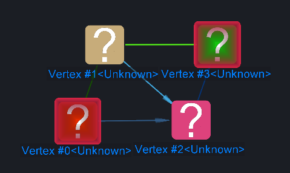
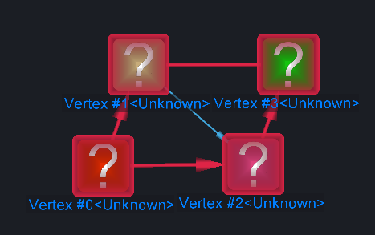

# Shortest Paths

<table data-border="1">
<caption>Shortest Paths Actions</caption>
<thead>
<tr class="header">
<th scope="col">Constellation Action</th>
<th scope="col">Keyboard Shortcut</th>
<th scope="col">User Action</th>
<th style="text-align: center;" scope="col">Menu Icon</th>
</tr>
</thead>
<tbody>
<tr class="odd">
<td>Run Shortest Paths</td>
<td></td>
<td>Selection -&gt; Shortest Paths</td>
<td style="text-align: center;"></td>
</tr>
<tr class="even">
<td>Run Directed Shortest Paths</td>
<td></td>
<td>Selection -&gt; Directed Shortest Paths</td>
<td style="text-align: center;"></td>
</tr>
</tbody>
</table>

Shortest Paths Actions

Shortest Paths is an implementation of the Dijkstra shortest paths
algorithm. When nodes within the same component are selected, the
Shortest Paths function will determine the path(s) with the smallest
number of transactions between the selected nodes, and highlight the
nodes and transactions along the path(s).

## Directed Shortest Paths

Directed Shortest Paths runs in a similar way except it only looks at
paths with directed transactions going in the direction of the source
node to the destination node. When you select Directed Shortest Paths, a
dialog box pops up prompting you to choose which node you have selected
is the source node.

Before Shortest Paths is run:

After Shortest Paths is run:

After Directed Shortest Paths is run (Source Node is Vertex #0):

