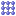
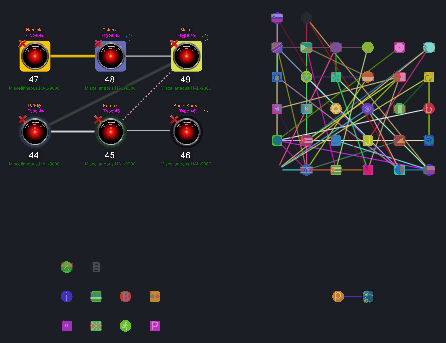

# Grid

<table data-border="1">
<caption>Grid Arrangement Actions</caption>
<thead>
<tr class="header">
<th scope="col">Constellation Action</th>
<th scope="col">Keyboard Shortcut</th>
<th scope="col">User Action</th>
<th style="text-align: center;" scope="col">Menu Icon</th>
</tr>
</thead>
<tbody>
<tr class="odd">
<td>Run Grid Arrangement</td>
<td>Ctrl + G</td>
<td>Arrange -&gt; Grid</td>
<td style="text-align: center;"></td>
</tr>
</tbody>
</table>

Grid Arrangement Actions

The grid arrangement arranges each separate component of the graph into
a square grid. Nodes within a grid are ordered left-to-right,
top-to-bottom by their internal node id's.

Example Grid Arrangement:

