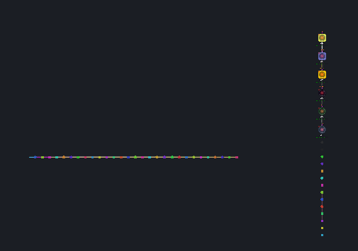

# Line

<table data-border="1">
<caption>Line Arrangement Actions</caption>
<thead>
<tr class="header">
<th scope="col">Constellation Action</th>
<th scope="col">Keyboard Shortcut</th>
<th scope="col">User Action</th>
<th style="text-align: center;" scope="col">Menu Icon</th>
</tr>
</thead>
<tbody>
<tr class="odd">
<td>Run Horizontal Line Arrangement</td>
<td>Ctrl + Alt + H</td>
<td>Arrange -&gt; Horizontal Line</td>
<td style="text-align: center;"></td>
</tr>
<tr class="even">
<td>Run Vertical Line Arrangement</td>
<td>Ctrl + Alt + V</td>
<td>Arrange -&gt; Vertical Line</td>
<td style="text-align: center;"></td>
</tr>
</tbody>
</table>

Line Arrangement Actions

The line arrangements arrange all the nodes of the graph into either a
horizontal or vertical line. The horizontal line orders nodes across the
x-axis and the vertical line orders nodes across the y-axis. Nodes are
ordered by their internal node id's.

Example Line Arrangements (Horizontal on left, Vertical on right):

