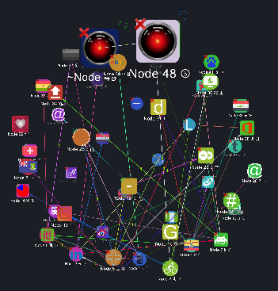

# Sphere

<table data-border="1">
<caption>Sphere Arrangement Actions</caption>
<thead>
<tr class="header">
<th scope="col">Constellation Action</th>
<th scope="col">Keyboard Shortcut</th>
<th scope="col">User Action</th>
<th style="text-align: center;" scope="col">Menu Icon</th>
</tr>
</thead>
<tbody>
<tr class="odd">
<td>Run Sphere Arrangement</td>
<td>Ctrl + Alt + K</td>
<td>Arrange -&gt; Sphere</td>
<td style="text-align: center;"></td>
</tr>
</tbody>
</table>

Sphere Arrangement Actions

The sphere arrangement arranges all the nodes of the graph into a
sphere.

Example Sphere Arrangement:

