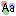
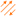

# About the 3D Visual Window

The visual window provides a 3D display of a graph.

## Graph components

Graphs are built from two elements; nodes and transactions.

-   Transactions can be directed or undirected.
-   A collection of transactions between two nodes in the same direction
    is called an edge. (There can be a maximum of three edges between
    two nodes.)
-   The collection of all transactions between two nodes (regardless of
    direction) is called a link. (There can be a maximum of one link
    between two nodes.)

## Navigating the graph

The graph can navigated using the mouse and keyboard keys. Menus can be
used to manipulate the graph. Some menus have keys assigned to them by
default, but you can change the key assignments using Tools → Options →
Keymap.

### Using the mouse

In general, the left button is for selecting, the middle button for
rotating, and the right button for dragging and panning.

<table data-border="1">
<caption>Navigating the graph using the mouse</caption>
<colgroup>
<col style="width: 50%" />
<col style="width: 50%" />
</colgroup>
<thead>
<tr class="header">
<th scope="col">Mouse Action</th>
<th scope="col">Graph Action</th>
</tr>
</thead>
<tbody>
<tr class="odd">
<td>Left-click on an element</td>
<td>Select a node or transaction.</td>
</tr>
<tr class="even">
<td>Left-click on the background</td>
<td>Set focus on the graph window.</td>
</tr>
<tr class="odd">
<td>Double-left-click on the background</td>
<td>Deselect all elements</td>
</tr>
<tr class="even">
<td>Shift-left-click on an element</td>
<td>Select additional nodes and/or transactions.</td>
</tr>
<tr class="odd">
<td>Ctrl-left-click on an element</td>
<td>Toggle selection of nodes and/or transactions.</td>
</tr>
<tr class="even">
<td>Left-drag</td>
<td>Select multiple nodes and/or transactions.</td>
</tr>
<tr class="odd">
<td>Shift-left-drag</td>
<td>Select additional multiple nodes and/or transactions.</td>
</tr>
<tr class="even">
<td>Ctrl-left-drag</td>
<td>Toggle selection of multiple nodes and/or transactions.</td>
</tr>
<tr class="odd">
<td>Middle-drag</td>
<td>Rotate the graph. 
Dragging the mouse up and down the middle of the window will rotate around the X axis. 
Dragging the mouse across the middle of the window will rotate around the Y axis. 
Dragging the mouse along the edges of the window will rotate around the Z axis.</td>
</tr>
<tr class="even">
<td>Right-drag on background</td>
<td>Pan the graph.</td>
</tr>
<tr class="odd">
<td>Right-drag on node</td>
<td>Drag the node and other selected nodes.</td>
</tr>
<tr class="even">
<td>Right-drag on transaction</td>
<td>Pan the graph.</td>
</tr>
</tbody>
</table>

Navigating the graph using the mouse

## Graph Sidebar

Each graph display has a sidebar containing some commonly used actions.

### Visibility Mode

<table data-border="1">
<caption>Actions that can be found on sidebar</caption>
<colgroup>
<col style="width: 50%" />
<col style="width: 50%" />
</colgroup>
<thead>
<tr class="header">
<th scope="col">Icon</th>
<th scope="col">Action</th>
</tr>
</thead>
<tbody>
<tr class="odd">
<td></td>
<td>Draw/don't draw nodes.</td>
</tr>
<tr class="even">
<td></td>
<td>Draw/don't draw connections.</td>
</tr>
<tr class="odd">
<td></td>
<td>Draw/don't draw labels on nodes.</td>
</tr>
<tr class="even">
<td></td>
<td>Draw/don't draw labels on connections.</td>
</tr>
<tr class="odd">
<td></td>
<td>Draw/don't draw blazes.</td>
</tr>
<tr class="even">
<td></td>
<td>Contract selected nodes into a <em>composite</em> node</td>
</tr>
<tr class="odd">
<td></td>
<td>Expand a <em>composite</em> node back to nodes and transactions</td>
</tr>
<tr class="even">
<td></td>
<td>Show all nodes, connections, blazers and labels. With this setting, the <a href="nbdocs://au.gov.asd.tac.constellation.visual.opengl/au/gov/asd/tac/constellation/display/docs/display-about.html"><strong>Graph Visibility Threshold</strong></a> is ignored.</td>
</tr>
<tr class="odd">
<td></td>
<td>Hide all nodes, connections, blazers and labels when the <a href="nbdocs://au.gov.asd.tac.constellation.visual.opengl/au/gov/asd/tac/constellation/display/docs/display-about.html"><strong>Graph Visibility Threshold</strong></a> is reached. 
Visualising a large graph will have an impact on performance so hiding everything on the graph can reduce the load on the graphics card. You can still use the histogram and table view to clean up your data before you enable graph visualisation.</td>
</tr>
<tr class="even">
<td></td>
<td>Freeze the camera from performing annimations when you run Data Access View plugins.</td>
</tr>
<tr class="odd">
<td></td>
<td>When disabled, allow the graph view to change when running Data Access View plugins.</td>
</tr>
</tbody>
</table>

Actions that can be found on sidebar

These buttons specify which display elements are drawn. Nodes are drawn
using an icon and a background shape and color. Connections (links,
edges, or transactions) are drawn using a color: when links and edges
are drawn and the underlying transactions have different colors, grey is
used. Text can be drawn above and below nodes: use the graph-level
attributes labels\_bottom and labels\_top to determine what text is drawn.

### Connection Mode

<table data-border="1">
<caption>The different connection modes</caption>
<thead>
<tr class="header">
<th scope="col">Icon</th>
<th scope="col">Connection Mode</th>
</tr>
</thead>
<tbody>
<tr class="odd">
<td></td>
<td>Draw links.</td>
</tr>
<tr class="even">
<td></td>
<td>Draw edges.</td>
</tr>
<tr class="odd">
<td></td>
<td>Draw transactions.</td>
</tr>
</tbody>
</table>

The different connection modes

These buttons specify whether links, edges, or transactions will be
displayed.

-   When links are drawn (all transactions between two nodes are draw as
    one link line, regardless of direction), the color of the line will
    be the same as the color of the transactions if all of the
    transactions between the two nodes are the same color; otherwise,
    the link will be drawn in grey.
-   When edges are drawn (transactions are drawn using up to three edge
    lines: one in each direction, and one undirected), the color of each
    line will be the same as the color of the transactions in that
    direction if all of the transactions in that direction between the
    two nodes are the same color; otherwise, the edge will be drawn in
    grey.
-   When transactions are drawn (each transaction is drawn with its own
    line), transactions are drawn individually up to a limit. By
    default, the limit is eight lines. If there are more than eight
    transactions between two nodes, they will be drawn as the
    corresponding edge.

### Graphics Mode

<table data-border="1">
<caption>The different graphics modes</caption>
<thead>
<tr class="header">
<th scope="col">Icon</th>
<th scope="col">Graphics Mode</th>
</tr>
</thead>
<tbody>
<tr class="odd">
<td></td>
<td>Two dimensional rotation</td>
</tr>
<tr class="even">
<td></td>
<td>Three dimensional rotation</td>
</tr>
</tbody>
</table>

The different graphics modes

Some graphs are two-dimensional (all nodes have z equal to 0), so it is
convenient to only allow one axis of rotation. With 2D selected,
rotation is restricted to the z-axis. With 3D selected, rotation is
allowed in the x, y, and z axes. Either way, rotation works as described
above.

The default for rotation can be changed at Tools → Options →
CONSTELLATION → Graph drawing.
