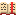
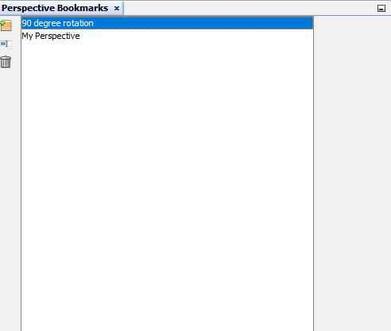

# Perspective Bookmarks

<table data-border="1">
<caption>Perspective Bookmarks Actions</caption>
<thead>
<tr class="header">
<th scope="col">Constellation Action</th>
<th scope="col">Keyboard Shortcut</th>
<th scope="col">User Action</th>
<th style="text-align: center;" scope="col">Menu Icon</th>
</tr>
</thead>
<tbody>
<tr class="odd">
<td>Open Perspective Bookmarks</td>
<td></td>
<td>Experimental -&gt; Views -&gt; Perspective Bookmarks</td>
<td style="text-align: center;"></td>
</tr>
</tbody>
</table>

Perspective Bookmarks Actions

## Introduction

The Perspective Bookmarks View allows you to bookmark a viewing position
so you can return to it later. It lets you keep different perspectives
on your graph.

## Creating a Bookmark

To add a perspective bookmark, move the camera in the graph window to
the position you want to save and select "Add a graph-relative
perspective". A new bookmark with a default name will be added. This new
bookmark can be renamed by selecting the bookmark and then selecting
"Rename selected perspective" to bring up the dialog allowing you to
choose a new name. A bookmark can be removed by selecting the bookmark
and then selecting "Remove a perspective".

## Using a Bookmark

Using a bookmark is as simple as double-clicking on the bookmark. This
will change the camera in the graph window to the setting saved in the
bookmark.
