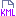

# Export From Constellation

<table data-border="1">
<caption>Export Actions</caption>
<thead>
<tr class="header">
<th scope="col">Constellation Action</th>
<th scope="col">Keyboard Shortcut</th>
<th scope="col">User Action</th>
<th style="text-align: center;" scope="col">Menu Icon</th>
</tr>
</thead>
<tbody>
<tr class="odd">
<td>Export to PNG</td>
<td></td>
<td>File -&gt; Export -&gt; To Image...</td>
<td style="text-align: center;"></td>
</tr>
<tr class="even">
<td>Export to JSON</td>
<td></td>
<td>File -&gt; Export -&gt; To JSON...</td>
<td style="text-align: center;"></td>
</tr>
<tr class="odd">
<td>Export to GeoJSON</td>
<td></td>
<td>File -&gt; Export -&gt; To GeoJSON...</td>
<td style="text-align: center;"></td>
</tr>
<tr class="even">
<td>Export to GeoPackage</td>
<td></td>
<td>File -&gt; Export -&gt; To GeoPackage...</td>
<td style="text-align: center;"></td>
</tr>
<tr class="odd">
<td>Export to Shapefile</td>
<td></td>
<td>File -&gt; Export -&gt; To Shapefile...</td>
<td style="text-align: center;"></td>
</tr>
<tr class="even">
<td>Export to KML</td>
<td></td>
<td>File -&gt; Export -&gt; To KML...</td>
<td style="text-align: center;"></td>
</tr>
</tbody>
</table>

Export Actions

Constellation provides a number of options for exporting a graph. Some
of these will present dialog boxes and details on those are further down
this page:

-   *Image* - Export a screenshot of the graph window as a .png
-   *JSON* - Export a JSON representation of the graph (described in
    detail
    [here](/au/gov/asd/tac/constellation/graph/docs/constellation-file-format.html))
-   *GeoJSON* - Export a GeoJSON representation of the graph
-   *GeoPackage* - Export the graph as a GeoPackage file
-   *Shapefile* - Export the graph as a Shapefile file
-   *KML* - Export the graph as a KML file

## Export to GeoJSON

### Parameters

-   *Output File* - the name and location of the output file
-   *Element Type* - the graph element type
-   *Attributes* - the list of attributes to include in the export
-   *Selected Only* - only export the selected elements

## Export to GeoPackage

### Parameters

-   *Output File* - the name and location of the output file
-   *Spatial Reference* - the spatial reference to use for the
    geopackage
-   *Element Type* - the graph element type
-   *Attributes* - the list of attributes to include in the export
-   *Selected Only* - only export the selected elements

## Export to Shapefile

### Parameters

-   *Output File* - the name and location of the output file
-   *Spatial Reference* - the spatial reference to use for the
    geopackage
-   *Element Type* - the graph element type
-   *Attributes* - the list of attributes to include in the export
-   *Selected Only* - only export the selected elements
-   *Geometry Type* - the geometry type to export

## Export to KML

### Parameters

-   *Output File* - the name and location of the output file
-   *Element Type* - the graph element type
-   *Attributes* - the list of attributes to include in the export
-   *Selected Only* - only export the selected elements

## Export to CSV and XLSX

Constellation also provides options to export to CSV and Excel (XLSX)
via the Table View. Refer
[here](/au/gov/asd/tac/constellation/views/tableview/docs/table-view.html)
for details.
