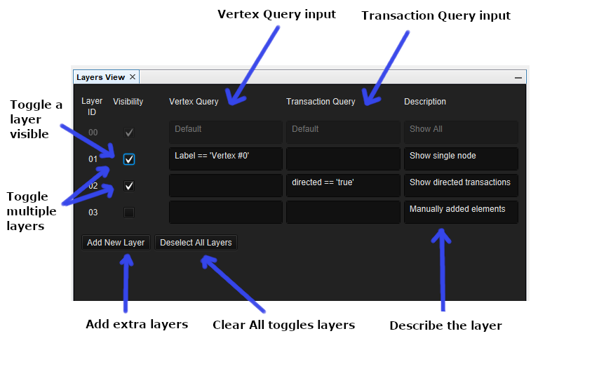
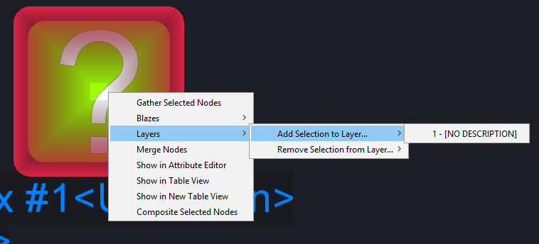

# Layers View

+-----------------+-----------------+-----------------+-----------------+
| **CONSTELLATION | **Keyboard      | **User Action** | **Menu Icon**   |
| Action**        | Shortcut**      |                 |                 |
+=================+=================+=================+=================+
| Open Layers     | Ctrl + Shift +  | Experimental    | ::              |
| View            | L               | -\> Views -\>   | : {style="text- |
|                 |                 | Layers View     | align: center"} |
|                 |                 |                 | {width="16" |
|                 |                 |                 | height="16"}    |
|                 |                 |                 | :::             |
+-----------------+-----------------+-----------------+-----------------+
| Add New Layer   | Ctrl + Alt + L  | Click \"Add New |                 |
|                 |                 | Layer\"         |                 |
+-----------------+-----------------+-----------------+-----------------+
| Deselect All    | Ctrl + Alt + D  | Click           |                 |
| Layers          |                 | \"Deselect All  |                 |
|                 |                 | Layers\"        |                 |
+-----------------+-----------------+-----------------+-----------------+
| Toggle On/Off   | Ctrl + Alt + x  | Tick/Untick     |                 |
| Layer x         | (x is the       | Visibility Box  |                 |
|                 | corresponding   | of              |                 |
|                 | layer number)   | corresponding   |                 |
|                 |                 | layer           |                 |
+-----------------+-----------------+-----------------+-----------------+

: Layers View Actions

## Introduction

The Layers View holds a collection of Layers. Each Layer can represent a
static set of elements, or a dynamically calculated set of elements
which match a query criteria.

::: {style="text-align: center"}

:::

## Creating and Using Layers

The two main ways to create and use layers are through the Layers View
window and through the use of shortcut keys (see table at the top of the
page for shortcut details). The maximum amount of layers you can create
is 64.

When a single layer is toggled on, that layer will be displayed on the
graph. When multiple manual layers are selected, it will display
everything on layer x, as well as everything on layer y (i.e. the union
of all selected layers).

## Layer Types

There are two main layer types within the Layers View. The
differentiating factor of the two being the way elements are chosen to
be displayed.

-   *Manual Layer* - A manual layer is a static layer only containing
    elements added via right click context menu (see above image).
-   *Query Layer* - A query layer is a dynamic layer that shows the
    elements represented by the specified Vertex and Transaction
    queries. Since a query layer is dynamic, it will get recalculated if
    the value the layer is concerned about changes. e.g. Layer 1 has a
    vertex query described as Label == \'Vertex \#0\'. This will show
    the vertex with that label. If you then change Vertex \#0\'s label
    to something like \'V\#0\', the query will note the change and
    recalculate for the whole graph.

## Query Language

A valid query for a vertex or transaction takes the form of
\[attributeName\] \[operator\] \[value\]. Any attribute name can be used
to query the graph and values must be surrounded with single or double
quotes. e.g. The vertex query Label == \'Vertex \#0\' would show all
graph elements whose label is Vertex \#0.

### Operators

Operators can be used to query, edit and compare values. This is the
current list of supported query operators:

  **Operator**             **Query Representation**
  ------------------------ --------------------------
  Equals                   ==
  Not Equals               !=
  Greater Than             \>
  Less Than                \<
  Greater Than Or Equals   \>=
  Less Than Or Equals      \<=
  Assign                   =
  And                      &
  Or                       \|
  XOR                      \^
  Not                      !
  Add                      \+
  Subtract                 \-
  Multiply                 \*
  Divide                   /
  Modulo                   \%
  Contains                 contains
  Starts With              startswith
  Ends With                endswith
  Or                       or
  And                      and
  Equals                   equals
  Not Equals               notequals

  : Layers View Query Operators

## Nested Queries

The query language also allows for nested queries. This makes querying
complex conditions possible. Nested queries are created by surrounding
internal queries with ( and ).

e.g. Label == \'Vertex \#0\<Unknown\>\' \|\| Label == \'Vertex
\#1\<Unknown\>\' shows elements that satisfy either constraint.

e.g. Label == \'Vertex \#0\<Unknown\>\' & nradius == \'1.5\' shows
elements that satisfy both constraints.
