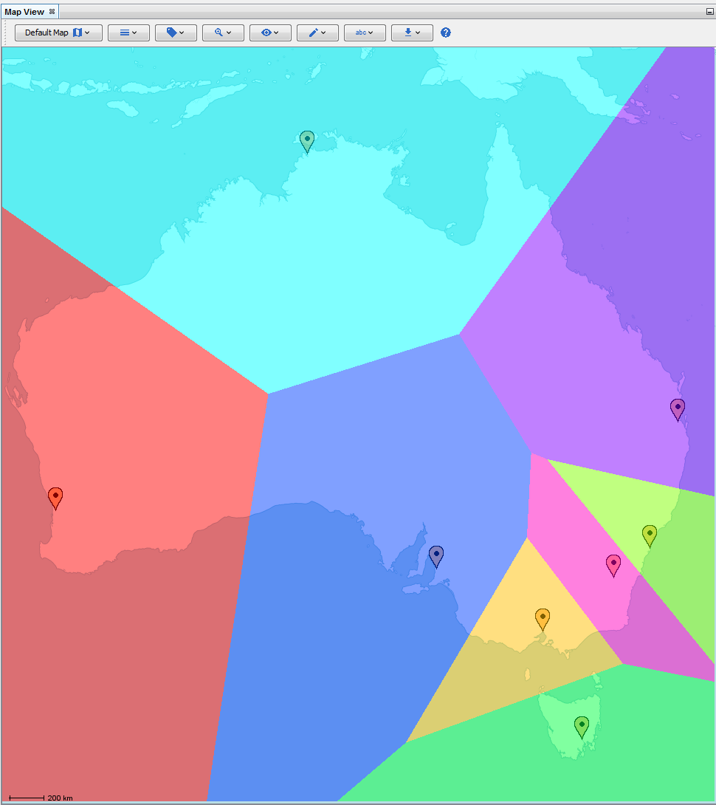

# Thiessen Polygons Layer

The thiessen polygons layer in the Map View will partition the map into
colored segments which equally separate markers.

::: {style="text-align: center"}
\
*The thiessen polygons layer.*
:::
