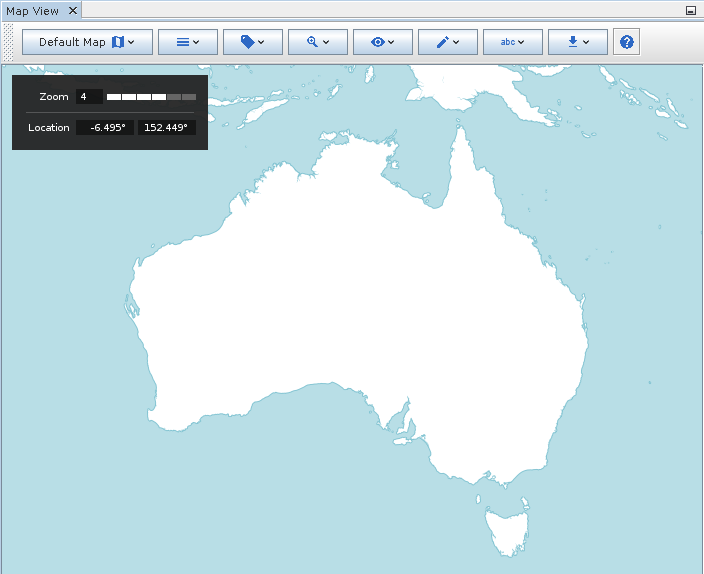
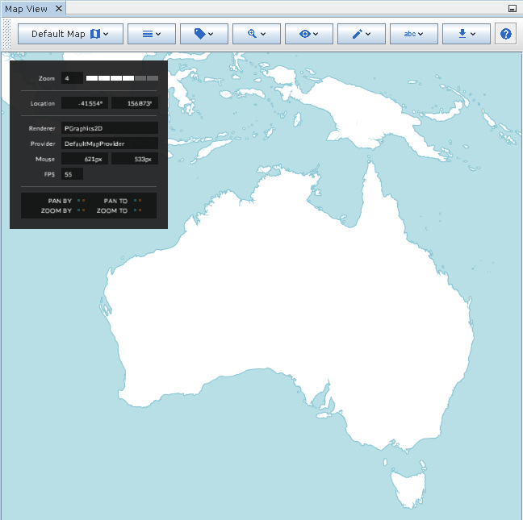

# Info Overlay

The info overlay displays basic information about the current state of
the map. By default, this will include the current coordinates of the
mouse pointer, and the current zoom level.

::: {style="text-align: center"}
\
*The info overlay.*
:::

If the map is in debug mode (refer to the Developer Guide for more
information on how to do this) then you will additionally see
information about the map renderer, such as an fps counter and
interaction indicators.

::: {style="text-align: center"}
\
*The info overlay in debug mode.*
:::
