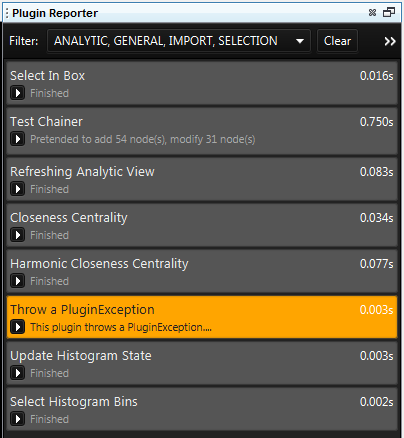
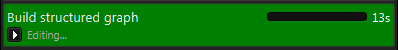
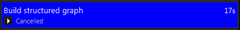
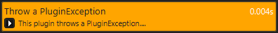
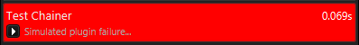
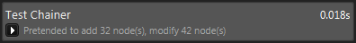

# Plugin Reporter

+-----------------+-----------------+-----------------+-----------------+
| **CONSTELLATION | **Keyboard      | **User Action** | **Menu Icon**   |
| Action**        | Shortcut**      |                 |                 |
+=================+=================+=================+=================+
| Open Plugin     | Ctrl + Shift +  | Views -\>       | ::              |
| Reporter        | P               | Plugin Reporter | : {style="text- |
|                 |                 |                 | align: center"} |
|                 |                 |                 | ![]             |
|                 |                 |                 | (../resources/p |
|                 |                 |                 | lugin-reporter. |
|                 |                 |                 | png){width="16" |
|                 |                 |                 | height="16"}    |
|                 |                 |                 | :::             |
+-----------------+-----------------+-----------------+-----------------+

: Plugin Reporter Actions

The Plugin Reporter stores a history of any plugin run on the graph
currently in focus.

::: {style="text-align: center"}

:::

A plugin report will be created whenever a plugin is run, and added to
the Plugin Reporter. These reports will change their color and message
based on the current status of the plugin they represent.

-   Green indicates the plugin is currently running.
    ::: {style="text-align: center"}
    
    :::
-   Blue indicates that the plugin was cancelled.
    ::: {style="text-align: center"}
    
    :::
-   Orange indicates that an anticipated error occurred.
    ::: {style="text-align: center"}
    
    :::
-   Red indicates that an unexpected error occurred.
    ::: {style="text-align: center"}
    
    :::
-   Grey indicates that the plugin finished successfully.
    ::: {style="text-align: center"}
    
    :::

The Plugin Reporter allows filtering of the plugin history using a
tag-based system. You can filter on plugin reports by their tags using
the \"Filter\" drop down menu. NOTE: You will only be able to filter
tags which are present in plugins that have already been executed. The
list of tags you can filter on may include:

-   *Analytic* - Plugins which perform some analytic calculation based
    on information on the graph.
-   *Import* - Plugins which add information to the graph, generally
    these will be found in the Data Access View.
-   *General* - Plugins which don\'t fit into any specific category.
-   *Low Level* - Plugins which are generally hidden from the user.
-   *Selection* - Plugins which change what is selected on the graph.

The \"Clear\" button will clear all currently displayed plugin reports,
and only display new plugin reports for the active graph.

The \"Show All\" button will make the Plugin Reporter display all plugin
reports for the active graph.
