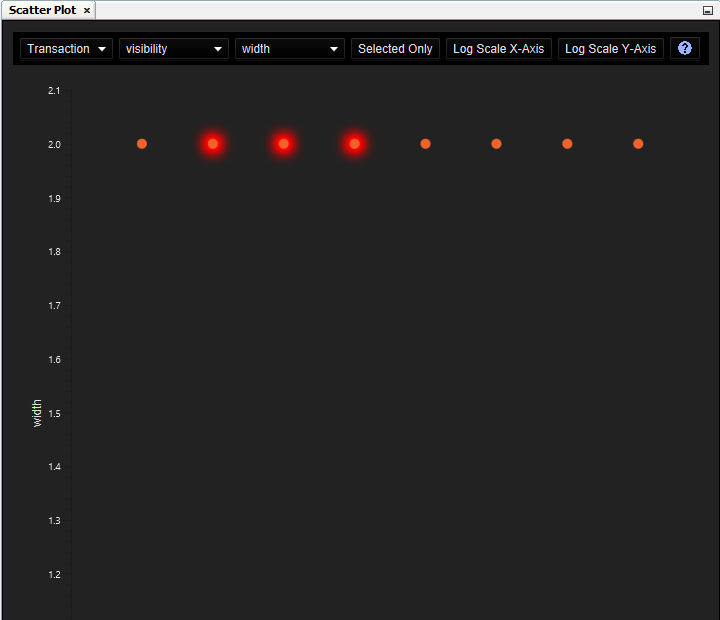

# Scatter Plot

+-----------------+-----------------+-----------------+-----------------+
| **CONSTELLATION | **Keyboard      | **User Action** | **Menu Icon**   |
| Action**        | Shortcut**      |                 |                 |
+=================+=================+=================+=================+
| Open Scatter    | Ctrl + Shift +  | Views -\>       | ::              |
| Plot            | O               | Scatter Plot    | : {style="text- |
|                 |                 |                 | align: center"} |
|                 |                 |                 | {width="16" |
|                 |                 |                 | height="16"}    |
|                 |                 |                 | :::             |
+-----------------+-----------------+-----------------+-----------------+

: Scatter Plot Actions

The Scatter Plot provides an interface for comparing numerical
attributes in a graph with the intention of discovering patterns, or
rather oddities within patterns in your graph.

::: {style="text-align: center"}

:::

The Scatter Plot is quite simple to use, you simply need to set values
for the 6 options in the top toolbar:

-   *Element Type* - This determines the element type of the graph whose
    attributes you wish to plot.
-   *X Attribute* - This is the attribute you wish to be drawn on the
    x-axis of the scatter plot. This will only be populated for
    numerical attributes (i.e. attributes of type boolean, integer,
    long, float or double).
-   *Y Attribute* - This is the attribute you wish to be drawn on the
    y-axis of the scatter plot. Likewise, this will only be populated
    with numerical attributes.
-   *Selected Only* - This will toggle between drawing all values on the
    scatter plot, or only including values which belong to elements
    currently selected on the graph.
-   *Log Scale X-Axis* - This will toggle between having a linear scale
    and a logarithmic scale on the x-axis. The logarithmic scale will
    only be applied if the graph is not empty.
-   *Log Scale Y-Axis* - This will toggle between having a linear scale
    and a logarithmic scale on the y-axis. The logarithmic scale will
    only be applied if the graph is not empty.

Upon selection of these options, the Scatter Plot will automatically
generate an interactive plot for you. Selecting elements in your graph
will select the corresponding elements in the Scatter Plot and vice
versa. Hovering over any element within the Scatter Plot will highlight
it for you and display its name within the graph.
