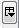

## Table View (Experimental)

The table view presents the attributes for all the nodes and
transactions in the graph. The highlighted rows in the table represent
the selected elements in the graph. The check box in the 'selected'
column is also checked when an element is selected in the graph.
Selection of the table rows (including the use of the shift and control
buttons) will result in the selection of the table rows and the
associated elements in the graph itself. Conversely, changes in the
selection set of the graph are reflected in the table.  
The table displays the attributes for all selected and unselected nodes
and transactions.

-   : View
    the node attributes

-   :
    View the transaction attributes

### Column Definition

The set of columns displayed in the table can be modified by selecting
the button
.  

### Row Ordering

The table rows can be sorting by selecting any of the column headers.

### Copy Data

There are multiple ways to copy data from the Table. All copy operations
will produce a comma separated output. The data is only copied to the
clipboard.

#### Copy all rows

This operation copies all column and all rows within the table. The
order of the column values is the same as how it is listed on the table.
This operation can be slow with a large graph.

#### Copy selected rows

This operation copies all column and selected rows within the table. The
order of the column values is the same as how it is listed on the table.

#### Copy columns

This operation provides the user the option to select specific column(s)
and specific rows. The order is alphabetical by default.

Column names that are listed on the right will be copied. The column
list on the right can be reordered to determine the order of the output.
Use the up and down arrows on the right to reorder the colum names. The
"Copy selected row(s) only" check box allows user to choose whether they
would like to copy all rows or just the rows that are currently
selected.
