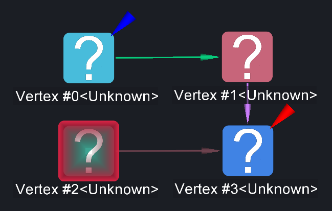
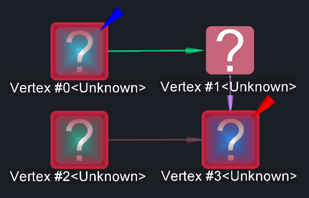

# Blaze Selection

<table data-border="1">
<caption>Blaze Selection Actions</caption>
<thead>
<tr class="header">
<th scope="col">Constellation Action</th>
<th scope="col">Keyboard Shortcut</th>
<th scope="col">User Action</th>
<th style="text-align: center;" scope="col">Menu Icon</th>
</tr>
</thead>
<tbody>
<tr class="odd">
<td>Run Select Blazes</td>
<td></td>
<td>Selection -&gt; Select Blazes</td>
<td style="text-align: center;"></td>
</tr>
<tr class="even">
<td>Run Deselect Blazes</td>
<td></td>
<td>Selection -&gt; Deselect Blazes</td>
<td style="text-align: center;"></td>
</tr>
</tbody>
</table>

Blaze Selection Actions

Select Blazes adds all nodes that are blazed to the current selection.
Conversely, Deselect Blazes deselects any nodes in the current selection
that are blazed.

Before Select Blazes is run:

After Select Blazes is run:

