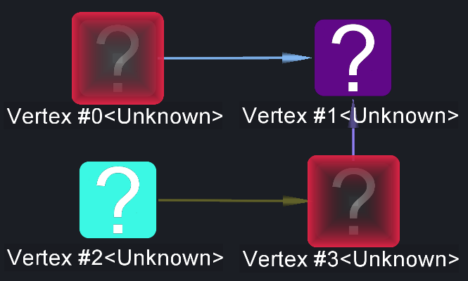
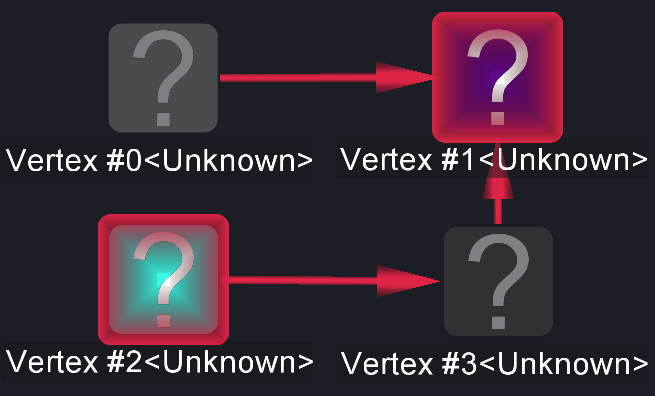

# Dimmed Selection

<table data-border="1">
<caption>Dimmed Selection Actions</caption>
<thead>
<tr class="header">
<th scope="col">Constellation Action</th>
<th scope="col">Keyboard Shortcut</th>
<th scope="col">User Action</th>
<th style="text-align: center;" scope="col">Menu Icon</th>
</tr>
</thead>
<tbody>
<tr class="odd">
<td>Run Select Dimmed</td>
<td></td>
<td>Selection -&gt; Select Dimmed</td>
<td style="text-align: center;"></td>
</tr>
<tr class="even">
<td>Run Select Undimmed</td>
<td></td>
<td>Selection -&gt; Select Undimmed</td>
<td style="text-align: center;"></td>
</tr>
</tbody>
</table>

Dimmed Selection Actions

Select Dimmed adds all nodes and transactions that are dimmed to the
current selection. Similarly, Select Undimmed adds all nodes and
transactions that are not dimmed to the current selection.

Before Any Dimmed Selection is run:

After Select Dimmed is run:

After Select Undimmed is run:

