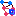

# Induced Subgraph

<table data-border="1">
<caption>Induced Subgraph Actions</caption>
<thead>
<tr class="header">
<th scope="col">Constellation Action</th>
<th scope="col">Keyboard Shortcut</th>
<th scope="col">User Action</th>
<th style="text-align: center;" scope="col">Menu Icon</th>
</tr>
</thead>
<tbody>
<tr class="odd">
<td>Run Select Half Hop Induced Subgraph</td>
<td></td>
<td>Selection -&gt; Select Half Hop Induced Subgraph</td>
<td style="text-align: center;"></td>
</tr>
<tr class="even">
<td>Run Select One Hop Induced Subgraph</td>
<td></td>
<td>Selection -&gt; Select One Hop Induced Subgraph</td>
<td style="text-align: center;"></td>
</tr>
</tbody>
</table>

Induced Subgraph Actions

## Half Hop Induced Subgraph

Half Hop Induced Subgraph will add all the transactions whose source and
destination nodes are already selected to the current selection.

## One Hop Induced Subgraph

One Hop Induced Subgraph will add to the current selection everything
the Half Hop Induced Subgraph will add as well as any nodes that have at
least two selected neighbours and the transactions connecting the node
and those neighbours.

Before Any Induced Subgraph Selection is run:

After Select Half Hop Induced Subgraph is run:

After Select One Hop Induced Subgraph is run:

