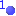
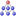
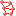
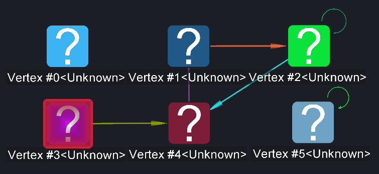
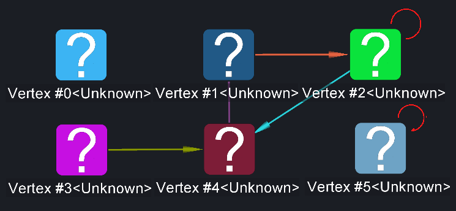
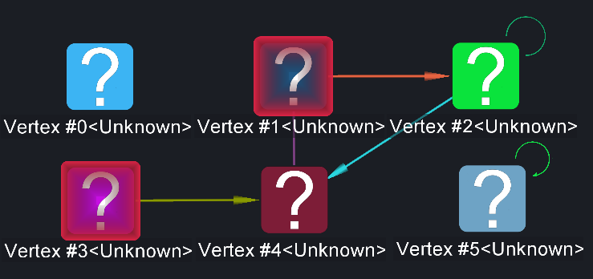
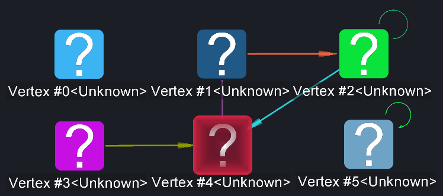
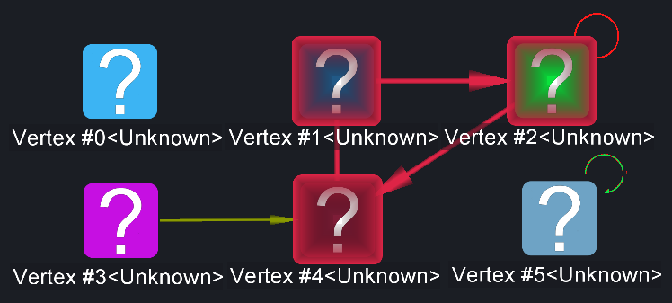

# Structure Selection

<table data-border="1">
<caption>Structure Selection Actions</caption>
<thead>
<tr class="header">
<th scope="col">Constellation Action</th>
<th scope="col">Keyboard Shortcut</th>
<th scope="col">User Action</th>
<th style="text-align: center;" scope="col">Menu Icon</th>
</tr>
</thead>
<tbody>
<tr class="odd">
<td>Run Select Singletons</td>
<td></td>
<td>Selection -&gt; Select Singletons</td>
<td style="text-align: center;"></td>
</tr>
<tr class="even">
<td>Run Select Pendants</td>
<td></td>
<td>Selection -&gt; Select Pendants</td>
<td style="text-align: center;"></td>
</tr>
<tr class="odd">
<td>Run Select Loops</td>
<td></td>
<td>Selection -&gt; Select Loops</td>
<td style="text-align: center;"></td>
</tr>
<tr class="even">
<td>Run Select Sources</td>
<td></td>
<td>Selection -&gt; Select Sources</td>
<td style="text-align: center;"></td>
</tr>
<tr class="odd">
<td>Run Select Sinks</td>
<td></td>
<td>Selection -&gt; Select Sinks</td>
<td style="text-align: center;"></td>
</tr>
<tr class="even">
<td>Run Select Backbone</td>
<td></td>
<td>Selection -&gt; Select Backbone</td>
<td style="text-align: center;"></td>
</tr>
</tbody>
</table>

Structure Selection Actions

## Select Singletons

Select Singletons adds all the nodes on your graph with no connected
transactions to the current selection.

After Select Singletons is run (nothing previously selected):

## Select Pendants

Select Pendants adds all the nodes on your graph with only one neighbour
to the current selection.

After Select Pendants is run (nothing previously selected):

## Select Loops

Select Loops adds all the loops on your graph to the current selection.

After Select Loops is run (nothing previously selected):

## Select Sources

Select Sources adds all the nodes on your graph with only outgoing
transactions to the current selection.

After Select Sources is run (nothing previously selected):

## Select Sinks

Select Sinks adds all the nodes on your graph with only incoming
transactions to the current selection.

After Select Sinks is run (nothing previously selected):

## Select Backbone

Select Backbone adds all the nodes on your graph with more than one
neighbour (excluding loops) and their adjoining transactions to the
current selection..

After Select Backbone is run (nothing previously selected):

