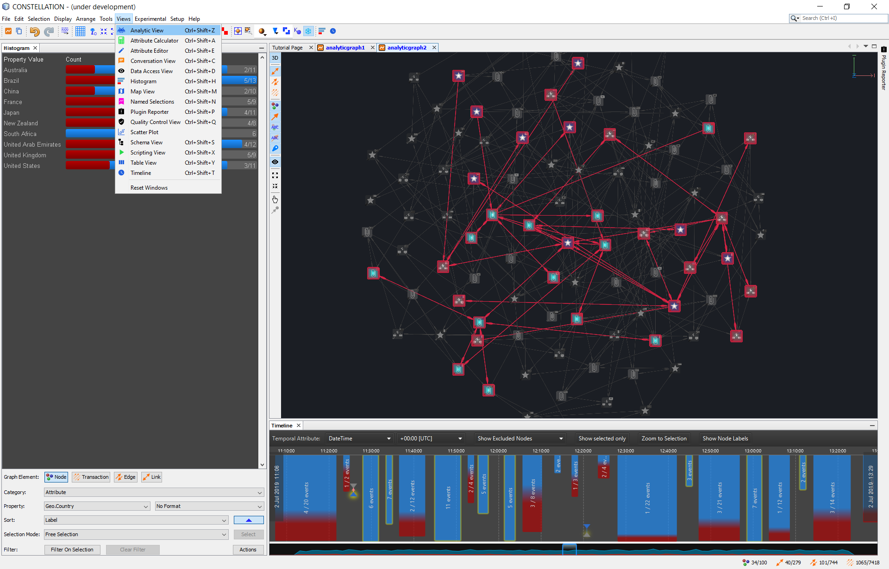

    

    
    <!--      -->
    <a href="https://github.com/constellation-app/constellation/releases" alt="Release downloads">
        
    <a/>
    
    
    

Constellation is a graph-focused data visualisation and interactive
analysis application enabling data access, federation and manipulation
capabilities across large and complex data sets.

# Table of Contents

-   [Vision Statement](#vision-statement)

-   [Core Values](#core-values)

-   [Prerequisites](#prerequisites)

-   [Download Constellation](#download-constellation)

-   [Run Constellation](#run-constellation)

-   [Build Constellation](#build-constellation)

-   [Package Constellation](#package-constellation)

-   [Contributing to Constellation](#contributing-to-constellation)

-   [Documentation](#documentation)

-   [Training](#training)

-   [Common Troubleshooting Checks](#common-troubleshooting-checks)

-   [Acknowledgments](#acknowledgments)

## Vision Statement

Constellation is a first class, domain agnostic data visualisation and
analysis application enabling the user to solve large and complex data
problems in a simple and intuitive way.

-   ***Users***: data analysts, data scientists, and all people
    interested in graph data analysis.

-   ***Data analysis domains***: graph datasets with rich feature data
    e.g. social networks, network infrastructure, chemical composition,
    etc.

## Core Values

### Performance over Functionality

The most important value is making sure Constellation stays performant.
If this means we have to sacrifice some functionality if it will degrade
performance then that’s what we will do. Features are “easy” to add but
keeping the application performant is harder.

### Generic over Specialisation

Constellation is designed to provide a broad range of functionality with
the idea of being a “bridge between tools”. For example Constellation’s
Map View is not meant to be a fully fledged mapping tool; for that use
ArcGIS.

### Usability over Precision

We value sensible defaults in features so you can just use them rather
than having to fill out a form of parameters first. This means that
running analytics like the “Cosine Similarity Analytic” will be
accurate but if you want to tweak this then you will have to use a
different method like a Jupyter Notebook.

## Prerequisites

-   The OpenGL graph display works with NVIDIA and ATI graphics cards
    that support OpenGL 3.3 or later. It is known to not work with older
    Intel on-board graphics cards.

## Download Constellation

Download Constellation by going to the [release
page](https://github.com/constellation-app/constellation/releases).

## Run Constellation

Unzip the constellation.zip bundle and double click the
`constellation64.bat` for Windows or run the `bin\constellation` shell
script for Linux and MacOSX.

Note that if you are running Constellation in a virtual machine and have issues 
using VirtualBox then give VMWare a go as it seems to have better support for 
OpenGL.

## Build Constellation

To build Constellation from source code do the following:

-   Download Azul’s Zulu distribution of JDK 21 with JFX 21, either the
    [Windows 64
    bit](https://cdn.azul.com/zulu/bin/zulu21.32.17-ca-fx-jdk21.0.2-win_x64.zip),
    [Linux 64
    bit](https://cdn.azul.com/zulu/bin/zulu21.32.17-ca-fx-jdk21.0.2-linux_x64.tar.gz)
    or [MacOSX 64
    bit](https://cdn.azul.com/zulu/bin/zulu21.32.17-ca-fx-jdk21.0.2-macosx_x64.tar.gz)

-   Download [NetBeans
    20](https://netbeans.apache.org/front/main/download/nb21/)

-   Update `netbeans_jdkhome` in netbeans.conf 
    (e.g. `C:\Program Files\NetBeans-12\netbeans\etc`) to point to the Azul Zulu
    JDK you downloaded
    (e.g. `C:\Program Files\Azul\zulu21.32.17-ca-fx-jdk21.0.2-win_x64`)

-   Clone this repository

-   Open the Constellation module suite from NetBeans

-   In the Projects view, expand `Important Files` &gt;
    `Build Script` &gt; Right click &gt;
    `Update dependencies and clean build`. This can take around 20
    minutes to download the first time depending on your internet
    connection so feel free to get a :coffee: and come back later.

-   Start Constellation by right clicking on `Constellation` &gt; `Run`

## Package Constellation

To package Constellation in a zip bundle do the following:

-   In NetBeans, expand `Constellation` &gt; `Important Files`

-   Right click on `Build Script` and run the `build-zip`

-   Navigate to the `dist` folder to get `constellation.zip` file

-   If you want to use a specific JRE
    (e.g. `zulu21.32.17-ca-fx-jre21.0.2-win_x64`) then copy this to the
    same level as the `bin` folder and call it `jre`. This is the
    default folder name Constellation expects but you can change this
    from `etc\constellation.conf`.

Note that Constellation “Core” (which is this repository) is designed to
be domain agnostic and work standalone. The version of Constellation
available for download from [the official
website](https://constellation-app.com) is built with additional plugins
and managed via the
[Constellation-Applications](https://github.com/constellation-app/constellation-applications)
repository.

## Contributing to Constellation

For more information please see the [contributing
guide](CONTRIBUTING.md).

## Documentation

-   Constellation 101 Slides *(coming soon)*

-   Overview Video *(coming later)*

-   [Quick Start Guide](docs/Constellation_Quick_Start_Guide.pdf)

-   User Guide *(coming later)*

-   Built in documentation to Constellation exists

## Training

-   [Constellation 
    Training](https://github.com/constellation-app/constellation-training/tree/master/Analyst%20Training)

-   [Developer
    Guide](https://github.com/constellation-app/constellation-training/tree/master/Developer%20Training)

-   [Example Module
    Template](https://github.com/constellation-app/constellation-module-example)

## Common Troubleshooting Checks

-   You can check whether your graphics card is supported by following
    these steps:

1.  Click on `File` &gt; `New Graph` to create a graph

2.  Click on `Experimental` &gt; `Build Graph` &gt; `Sphere Graph` to
    create a random graph.

3.  If you can see a graph try to interact with it using the mouse.

4.  If the graph view remains blank, you may not have a supported
    graphics card.

-   Click on `Help` &gt; `JOGL Version` to see the graphics card
    capabilities of your machine.

-   Click on `Help` &gt; `Show Logs` to view Constellation log
    information.

## Acknowledgments

Third party libraries and assets were used in development of
Constellation, please view [attribution list](ATTRIBUTION.md) for
details.
