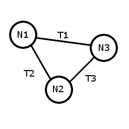

Cut, Copy, Paste
----------------

Background
``````````

Each node and transaction in a graph has a unique key. This key may be constructed from one or many attributes of any types. When pasting elements into a graph, the key is used to determine if they are duplicates, and which elements they will be connected to.

Copying
```````

Pasting into the same graph
```````````````````````````

The diagram below shows a graph with three nodes (with keys N1, N2, N3) and three transactions (with keys T1, T2, T3).

If N3 is selected and cut from the graph, transactions T1 and T3 are removed (since a transaction must have a node at each end). However, the transactions do not go into the clipboard, since they weren't selected. This means that a paste back into the graph will paste N3, but not T1 and T3.

Another paste will have no effect. Since the paste is attempting to insert a node with key N3 into a graph that already has a node with key N3, and there can't be two nodes with duplicate keys, the paste will not change the graph. This duplication works on a node-by-node basis: pasting two nodes N3 and N4 into the graph above will add N4 to the graph, but not N3.

Transactions work in the same way. If T1 is cut and then a paste is done, T1 will be added back to the graph, but subsequent pastes will do nothing, since there can't be duplicate transactions with key T1.

Pasting into a different graph
``````````````````````````````

Pasting into a different graph works the same way as pasting into the same graph as long as the graphs have the same attributes. If the elements being pasted have attributes with the same name but different types, the paste will not work. If the elements being pasted have attributes that the graph being pasted into doesn't have, those attributes will be created in the destination graph.

In the case where a cut or copy is done, attributes are edited so they don't match was was cut/copied, and a paste is done back into the same graph, the modified graph is treated like a different graph.

Pasting into a text editor
``````````````````````````

If CONSTELLATION detects that you are pasting into a text editor, it will paste the text of the key values of each element, with each key on a separate line.




.. help-id: au.gov.asd.tac.constellation.graph.interaction.cliboard
