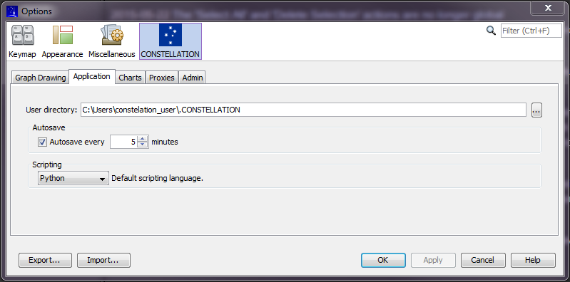

Auto Backup Feature
```````````````````

Constellation has an automatic backup feature that periodically creates a backup of your graph while you work (regardless of whether the graph has ever been saved or not. By default, the auto backup feature is enabled and it is executed every 10 minutes.

By clicking "Setup → Options → Constellation", the user can control the activation of the feature and the frequency it is executed.

|resources-autosave.png|

While working in Constellation, if the system were to experience a computer crash or power outage, or if for some reason the application crashes without giving you the opportunity to save your changes, then there may be a lose of data since you had not had the opportunity to save your work.

When Constellation is restarted, the application will first check to see if any of the auto backup files were associated with unsaved graphs. If there are any files, the user will be asked whether they would like to reload them. Once these files have been reloaded, the user can continue to work on the graphs.




.. help-id: au.gov.asd.tac.constellation.graph.file.autosave
