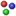
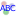
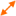
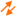
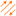
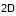
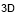

About the 3D Visual Window
--------------------------

The visual window provides a 3D display of a graph.

Graph components
````````````````

Graphs are built from two elements; nodes and transactions.

* Transactions can be directed or undirected.
* A collection of transactions between two nodes in the same direction is called an edge. (There can be a maximum of three edges between two nodes.)
* The collection of all transactions between two nodes (regardless of direction) is called a link. (There can be a maximum of one link between two nodes.)

Navigating the graph
````````````````````

The graph can navigated using the mouse and keyboard keys. Menus can be used to manipulate the graph. Some menus have keys assigned to them by default, but you can change the key assignments using Tools → Options → Keymap.

Using the mouse
:::::::::::::::

In general, the left button is for selecting, the middle button for rotating, and the right button for dragging and panning.

Navigating the graph using the mouse

.. csv-table::
   :header: "Mouse Action","Graph Action"

   "Left-click on an element","Select a node or transaction."
   "Left-click on the background","Set focus on the graph window."
   "Double-left-click on the background","Deselect all elements"
   "Shift-left-click on an element","Select additional nodes and/or transactions."
   "Ctrl-left-click on an element","Toggle selection of nodes and/or transactions."
   "Left-drag","Select multiple nodes and/or transactions."
   "Shift-left-drag","Select additional multiple nodes and/or transactions."
   "Ctrl-left-drag","Toggle selection of multiple nodes and/or transactions."
   "Middle-drag","Rotate the graph."
   "Right-drag on background","Pan the graph."
   "Right-drag on node","Drag the node and other selected nodes."
   "Right-drag on transaction","Pan the graph."

Graph Sidebar
`````````````

Each graph display has a sidebar containing some commonly used actions.

Visibility Mode
:::::::::::::::

Actions that can be found on sidebar

.. csv-table::
   :header: "Icon","Action"

   "|resources-nodes.png|","Draw/don't draw nodes."
   "|resources-connections.png|","Draw/don't draw connections."
   "|resources-node_labels.png|","Draw/don't draw labels on nodes."
   "|resources-connection_labels.png|","Draw/don't draw labels on connections."
   "|resources-blazes.png|","Draw/don't draw blazes."
   "|resources-expand.png|","Contract selected nodes into a *composite* node"
   "|resources-contract.png|","Expand a *composite* node back to nodes and transactions"
   "|resources-visible.png|","Show all nodes, connections, blazers and labels. With this setting, the `*Graph Visibility Threshold* <nbdocs://au.gov.asd.tac.constellation.visual.opengl/au/gov/asd/tac/constellation/display/docs/display-about.html>`_ is ignored."
   "|resources-hidden.png|","Hide all nodes, connections, blazers and labels when the `*Graph Visibility Threshold* <nbdocs://au.gov.asd.tac.constellation.visual.opengl/au/gov/asd/tac/constellation/display/docs/display-about.html>`_ is reached."
   "|resources-snowflake.png|","Freeze the camera from performing annimations when you run Data Access View plugins."
   "|resources-snowflake_alternate.png|","When disabled, allow the graph view to change when running Data Access View plugins."

These buttons specify which display elements are drawn. Nodes are drawn using an icon and a background shape and color. Connections (links, edges, or transactions) are drawn using a color: when links and edges are drawn and the underlying transactions have different colors, grey is used. Text can be drawn above and below nodes: use the graph-level attributes ``labels_bottom`` and ``labels_top`` to determine what text is drawn.

Connection Mode
:::::::::::::::

The different connection modes

.. csv-table::
   :header: "Icon","Connection Mode"

   "|resources-links.png|","Draw links."
   "|resources-edges.png|","Draw edges."
   "|resources-transactions.png|","Draw transactions."

These buttons specify whether links, edges, or transactions will be displayed.

* When links are drawn (all transactions between two nodes are draw as one link line, regardless of direction), the color of the line will be the same as the color of the transactions if all of the transactions between the two nodes are the same color; otherwise, the link will be drawn in grey.
* When edges are drawn (transactions are drawn using up to three edge lines: one in each direction, and one undirected), the color of each line will be the same as the color of the transactions in that direction if all of the transactions in that direction between the two nodes are the same color; otherwise, the edge will be drawn in grey.
* When transactions are drawn (each transaction is drawn with its own line), transactions are drawn individually up to a limit. By default, the limit is eight lines. If there are more than eight transactions between two nodes, they will be drawn as the corresponding edge.

Graphics Mode
:::::::::::::

The different graphics modes

.. csv-table::
   :header: "Icon","Graphics Mode"

   "|resources-2d.png|","Two dimensional rotation"
   "|resources-3d.png|","Three dimensional rotation"

Some graphs are two-dimensional (all nodes have z equal to 0), so it is convenient to only allow one axis of rotation. With 2D selected, rotation is restricted to the z-axis. With 3D selected, rotation is allowed in the x, y, and z axes. Either way, rotation works as described above.

The default for rotation can be changed at Tools → Options → CONSTELLATION → Graph drawing.



.. |resources-connections.png| image:: resources-connections.png




.. |resources-snowflake.png| image:: resources-snowflake.png

.. |resources-snowflake_alternate.png| image:: resources-snowflake_alternate.png












.. help-id: au.gov.asd.tac.constellation.functionality.visual
