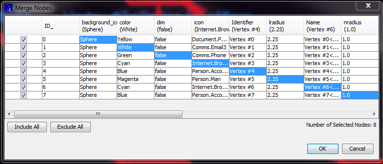

Merge Nodes
```````````

Identifying the merge nodes
:::::::::::::::::::::::::::

By default, all of the nodes are selected for merging. The selected nodes are marked in the table by the check box in the left-most column. Any node can be excluded/included from the merge operation by either clicking in the checkbox or using the *Include All* or *Include All* actions in the lower left-hand corner of the panel.

Identification of attributes
::::::::::::::::::::::::::::

By default, the final merge node will get a copy of all the attributes of the first node listed in the table.




.. help-id: au.gov.asd.tac.constellation.graph.visual.mergeNodes
