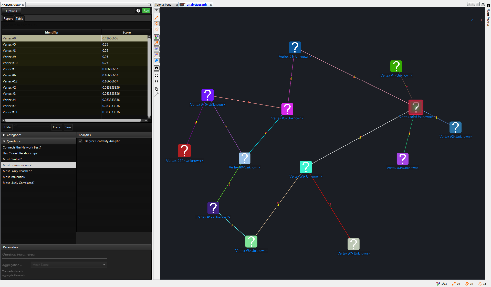
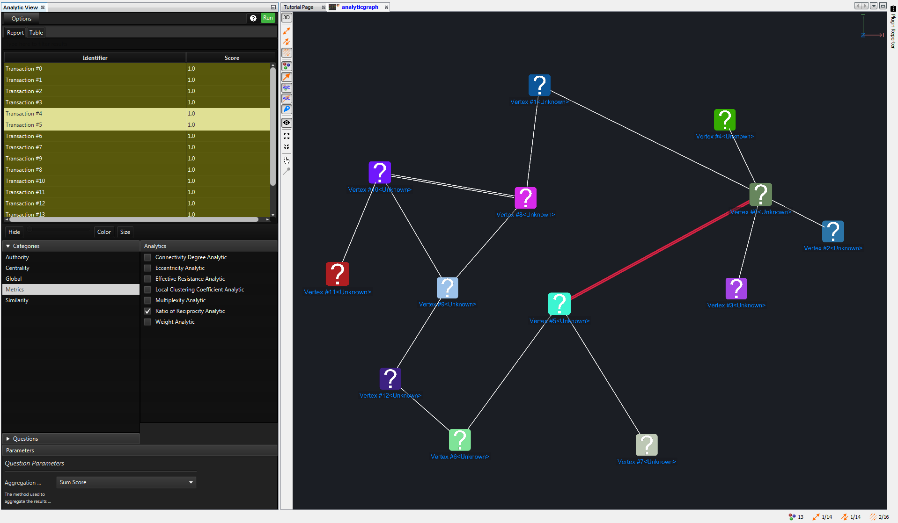

Analytic View
-------------

How to open Analytic View

|---resources-analytic-view.png|

.. csv-table::
   :header: "*CONSTELLATION Action*","*User Action*","*Menu Icon*"

   "Open Analytic View","Views -> Analytic View",""

The Analytic View is a tool for computing analytics across a graph in a user-friendly manner. This is done by posing complex algorithms as simple questions you might ask of the graph. These algorithms range in functionality from scoring based on the structure of a graph, to clustering and partitioning the graph, and even analysing content stored on a graph.

|resources-analyticview-question.png| *Here we have used the Analytic View to ask which nodes are 'most highly connected' on the graph.*

* *Configuration:* This is the options toolbar, which allows you to configure the Analytic View, browse to this help document, or execute the currently selected analytic question.
* *Analytic Visualisation:* After a question is executed, the results of the chosen analytic question will appear. The visualisations available will differ based on the particular result type of the question executed.
* *Graph Visualisation:* After a question is executed, you will also be given a series of options allowing you to change the graph visualisation based on the result set. These options will also differ depending on the type of result.
* *Question Definition:* This is where you can construct an analytic question to ask of the graph. You can choose to run a pre-defined question from the 'Questions' list, The 'Analytics' list will be populated with the analytics specified by that question, and each analytic will have pre-defined parameters which can be viewed by clicking each analytic. Alternatively, you can choose to define your own custom question by selecting a category under the 'Categories' list, and then selecting any number of the analytics which will populate the 'Analytics' list and configuring their individual parameters. These custom questions can be saved to the 'Questions' list for later use by selecting 'Save Question' from the 'Options' menu.
* *Analytic Parameters:* This is where you can configure the parameters related to a question. If you are using a pre-defined question, the parameters cannot be changed but can still be viewed here. If you are building your own question, you have full control over these parameters. Selecting a question or category will populate the parameters pane with any parameters affecting the question as a whole. Selecting an individual analytic will additionally populate the parameters pane with any parameters specific to that analytic. Any changes you make to parameter values will be remembered for as long as the Analytic View is open.

|resources-analyticview-category.png| * Here we have defined a custom question which will calculate the 'Ratio of Reciprocity' analytic across only the specified subset of transaction types on the graph. *

.. help-id: au.gov.asd.tac.constellation.views.analyticview.AnalyticViewPane
