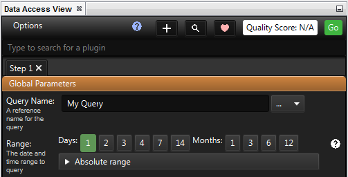
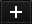
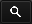
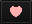

Data Access View
----------------

How to open Data Access View

.. csv-table::
   :header: "*CONSTELLATION Action*","*User Action*","*Menu Icon*"

   "Open Data Access View","Views -> Data Access View","|---panes-resources-data-access-view.png|"

Introduction
````````````

Data Access View is the interface for interacting with CONSTELLATION plugins that involve data. It allows users to perform queries that do things such as import, enrich, and clean data, all from the one window.

|resources-DataAccessView.png|

Running Queries
```````````````

At the very top, there is a list of tabs. Pressing the |resources-DataAccessAdd.png| button allows tables to be added, and the X in the tab name will remove it. Tabs can be customised to perform different queries, and when ready, pressing the |resources-DataAccessGo.png| button will cause each tab to run their queries sequentially. The |resources-DataAccessGo.png| button will only highlight once a check box has been selected and a graph has been opened.

In the tab, users can enter values for the global parameters that will apply to every query they run in that tab. The Range option allows users to specify the time period they wish to run the query. Selecting one of the Days or Months buttons will run the query from that many months or days ago to the present day. Alternatively, a custom time period can be selected by pressing custom and inputting a from and to date.

From the tabs below, users can select which queries they wish to run. The arrows allow options to be visible or hidden. Selecting the checkbox next to the name of the query will cause that query to run when |resources-DataAccessGo.png| is pressed.

*Note* that the queries in the Data Access View only run using graph elements that have been selected.

*Note* that when |resources-DataAccessGo.png| is pressed, the fields in the Global Parameters section like *Query Name* are saved as part of the graph's state so that when you save and load the graph, the last used values are restored.

Global Parameters
`````````````````

Refer to the `global parameters <data-access-global-parameters.html>`_ page for more details on the global parameters section.

Filtering
`````````

You can filter plugins by clicking on |resources-DataAccessSearch.png| and typing into the text field beneath. Alternatively, you can right click anywhere on the Data Access View and chose the *Search plugins* option.

Favourites
``````````

You can add plugins to your favourites category by clicking on |resources-DataAccessFavourite.png| which will allow you to add or remove plugins you have selected from the favourites category.

Options Menu
````````````

Refer to the `options <data-access-options.html>`_ page for more details on the options menu.












.. help-id: au.gov.asd.tac.constellation.views.dataaccess.panes.DataAccessViewTopComponent
