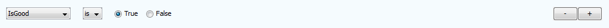
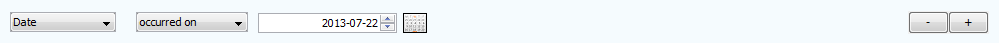
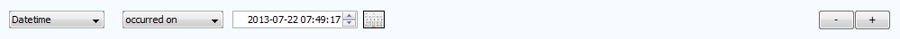
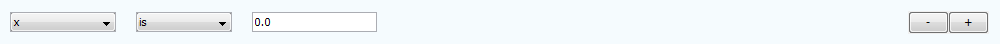
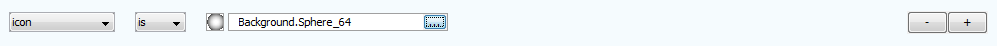
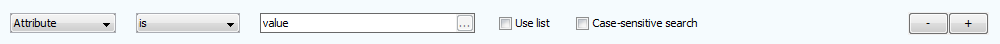

Find
````

The *Find Window* allows the creation of sophisticated rules to be searched for, and 'matched' on a graph. An example of a Find Window can be seen below.

Major Elements of the Find Window
`````````````````````````````````

There are several major components found on a Find Window. They are:

* Combo-box where a selection between searching on 'Nodes' or 'Transactions' may be made. Searches will only be performed on the selected graph element type.
* Combo-box where a selection between whether 'all' (binary AND) or 'any' (binary OR) rules must be matched for a graph element to be returned as a result of a search.
* A find 'rule'. For any given search operation, one or more find rules must be created.
* An input box where the value to be matched is placed.
* A check-box that determines whether any results of a search are added to the current selection on the graph, or replace it. (Ticked indicates that the results are added.)
* Removes the find rule it appears on.
* Adds a blank find rule to the end of the list.
* Indicates the number of results found for the search.
* Button that reset the window to a single blank rule.
* Combo-box that allows the selection of the graph attribute to search on.
* Combo-box that indicates the form the search will take. For example 'contains', 'is', 'occurred on', 'is between', etc.
* Button that allows the adding of a delimited list of strings to be added.
* Option for string attributes that allows a list of values to be searched for. A comma separated list in the value input box will be searched and results returned for any matches. (List searches are performed as binary OR operations).
* Option to force case-sensitive searches on strings.
* Button that performs a search with the rules specified.

Supported Find Rule Types
`````````````````````````

There are currently 8 supported attribute types that can be searched for in various ways. Attribute types that are not registered as one of the following types will be searched as 'strings.' The types are as follows:

* Boolean searches: |resources-find-boolean.png|
* Colour searches: |resources-find-color.png|
* Date searches: |resources-find-date.png|
* DateTime searches: |resources-find-datetime.png|
* Float searches: |resources-find-float.png|
* Icon searches: |resources-find-icon.png|
* String searches: |resources-find-string.png|
* Time searches: |resources-find-time.png|

.. |resources-find-main.png| image:: resources-find-main.png



.. |resources-find-color.png| image:: resources-find-color.png











.. |resources-find-time.png| image:: resources-find-time.png


.. help-id: au.gov.asd.tac.constellation.views.find
