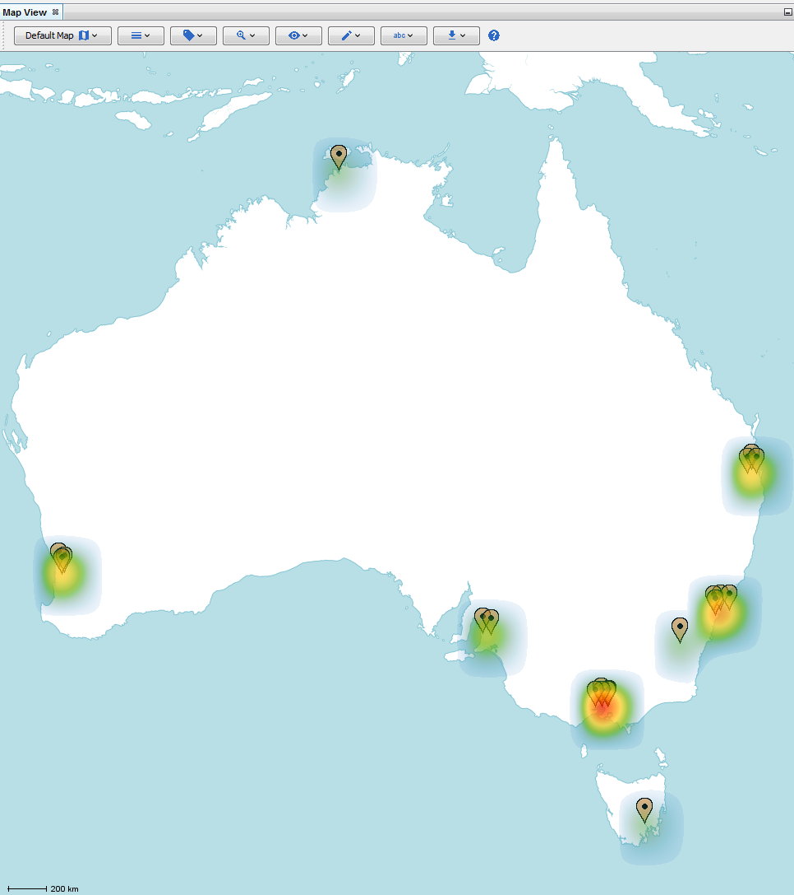

Heatmap Layers
--------------

The heatmap layers in the Map View will generate a Gaussian Blur around all markers to indicate density. This density can be weighted in various ways. could represent the number of markers (standard), the number of nodes connected to markers (popularity), or the number of transactions connected to markers (activity).

Standard Heatmap
````````````````

The standard heatmap represents the density of nodes at a location. This means that a marker representing two nodes on the graph will appear hotter than a marker representing only one node.

Popularity Heatmap
``````````````````

The popularity heatmap represents the density of nodes connected to a location. This means that a marker representing a node with two neighbours on the graph will appear hotter than a marker representing a node with only one neighbour.

Activity Heatmap
````````````````

The activity heatmap represents the density of transactions connected to a location. This means that a marker representing a node with two adjacent transactions on the graph will appear hotter than a marker representing a node with only one adjacent transaction.

|resources-mapview-layers-heatmap.png| *The heatmap (activity) Layer.*




.. help-id: au.gov.asd.tac.constellation.views.mapview.layers.AbstractHeatmapLayer
