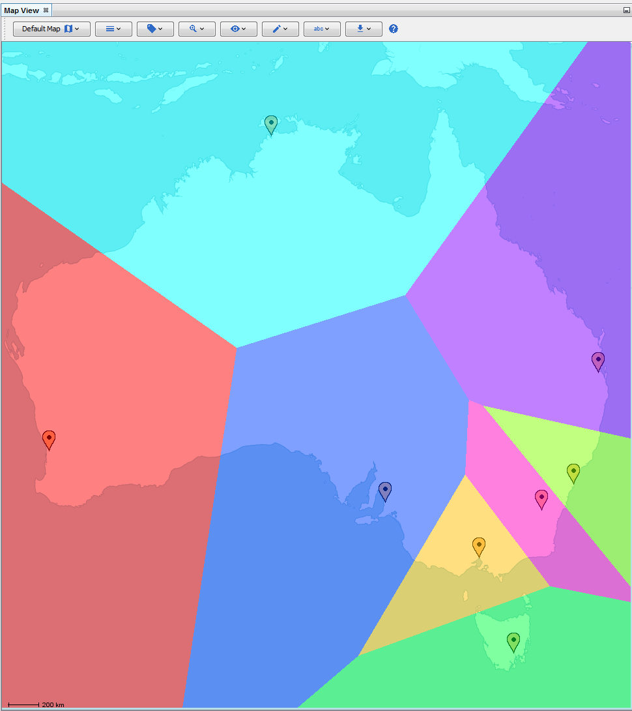

Thiessen Polygons Layer
-----------------------

The thiessen polygons layer in the Map View will partition the map into colored segments which equally separate markers.

|resources-mapview-layers-thiessen-polygons.png| *The thiessen polygons layer.*

.. help-id: au.gov.asd.tac.constellation.views.mapview.layers.ThiessenPolygonsLayer
