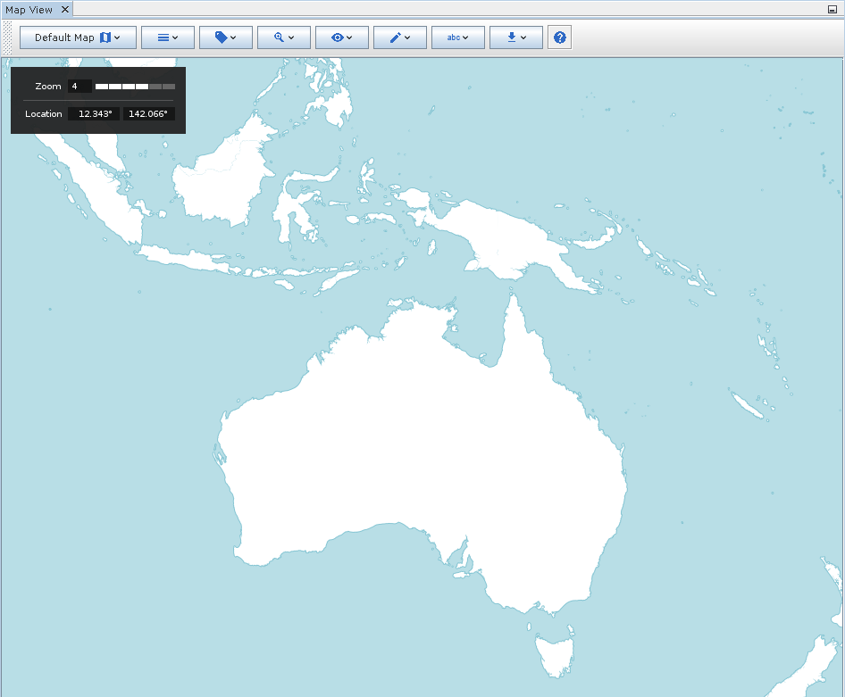
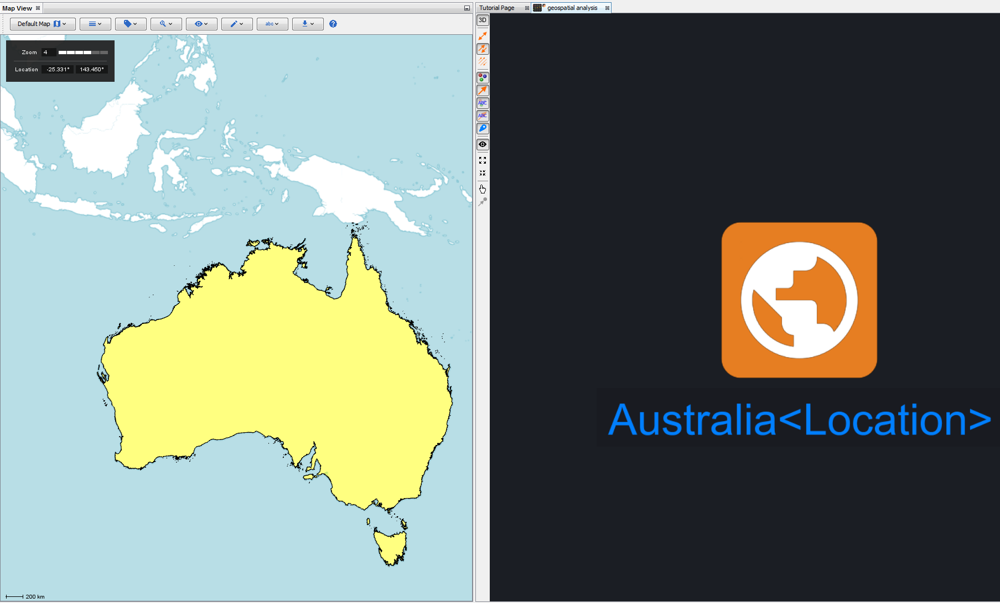
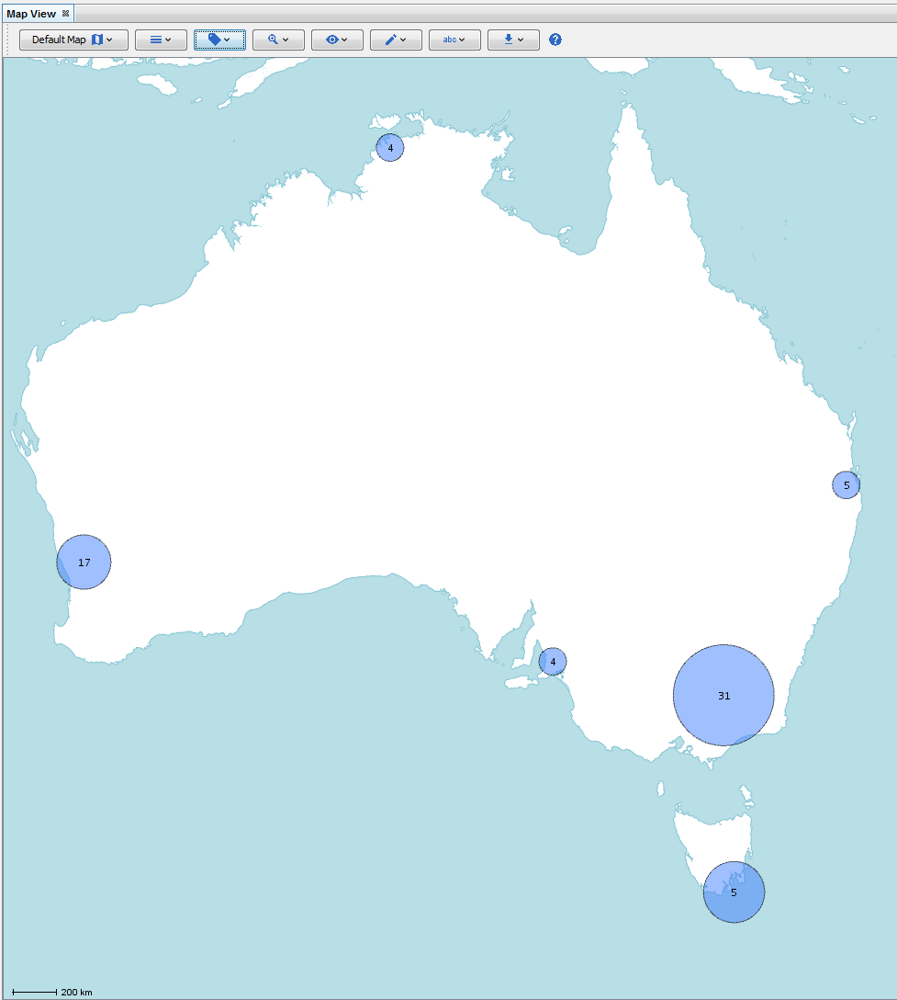

Map View
--------

How to open Map View

|---resources-map-view.png|

.. csv-table::
   :header: "*CONSTELLATION Action*","*User Action*","*Menu Icon*"

   "Open Map View","Views -> Map View",""

The Map View provides a visualisation of geospatial data in a Constellation graph as well as features for basic geospatial analysis.

|resources-mapview-main.png| *The default layout of the Map View.*

The configuration toolbar at the top of the Map View offers a range of tools for customising and interacting with the map.

|resources-mapview-markers.png| *Graph nodes are represented on the map as various types of markers depending on the information available.* |resources-mapview-clusters.png| *Markers can also be clustered together based on their proximity to one another.*

* Base maps are provided by local or network tile servers, with the default map being a simple built-in map consisting only of country borders. The Map View can be extended to source its base map data from a custom location (refer to the Developer Guide for more information on how to do this). You can switch between available base maps using the *Base Maps* menu.
* Layers can be rendered on top of the map in order to provide additional visualisations for analytic purposes. Layers can be switched on and off using the *Layers* menu.
* Overlays can be rendered on top of the map in order to provide additional information or features to the Map View. Overlays can be switched on and off using the *Overviews* menu.
* You can zoom to markers or custom locations on the map using the *Zoom* menu.
* The Map View is capable of rendering points, lines, polygons and multi-polygons to represent geospatial data on a graph. By default, it will read from the *Geo.Latitude* and *Geo.Longitude* attributes for point data, and the *Geo.Shape* attribute for line, polygon and multi-polygon data, where it will expect to find a GeoJSON object representing the shape as a Feature Collection. The Map View can also render clusters (calculated using marker centroids). All of these marker types can be switched on and off using the *Marker Visibility* menu.
* You customise markers with colours and labels using data on the graph. This can be achieved by selecting options in the *Marker Colours* and *Marker Labels* menus.
* Geospatial data can be exported to a range of open data formats using the *Export* menu.
* You can open this help document using the *Help* button.

.. help-id: au.gov.asd.tac.constellation.views.mapview.MapViewTopComponent
