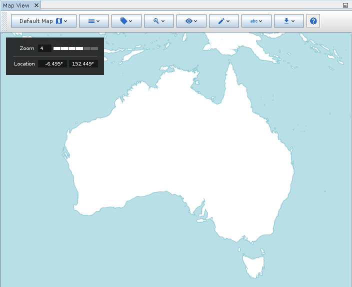
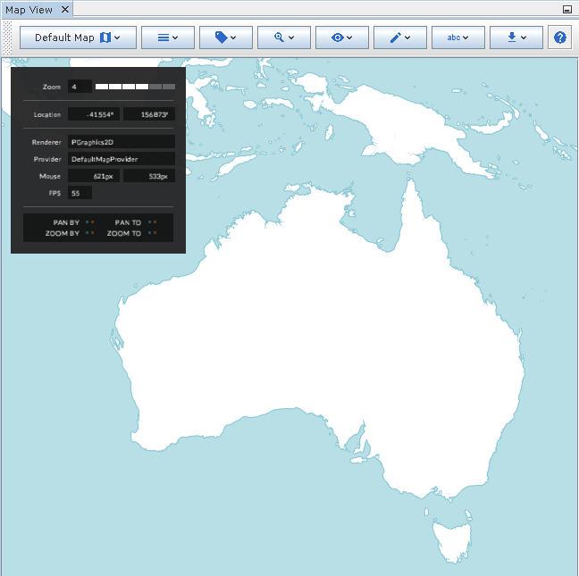

Info Overlay
------------

The info overlay displays basic information about the current state of the map. By default, this will include the current coordinates of the mouse pointer, and the current zoom level.

|resources-mapview-overlays-info.png| *The info overlay.*

If the map is in debug mode (refer to the Developer Guide for more information on how to do this) then you will additionally see information about the map renderer, such as an fps counter and interaction indicators.

|resources-mapview-overlays-info-debug.png| *The info overlay in debug mode.*

.. help-id: au.gov.asd.tac.constellation.views.mapview.overlays.InfoOverlay
