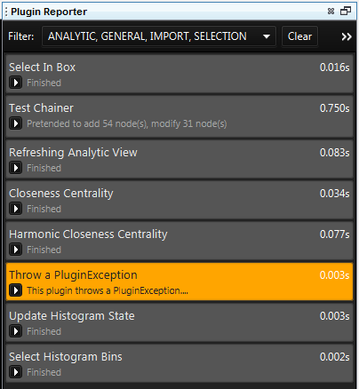
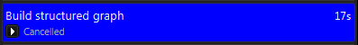
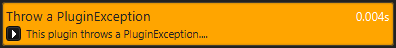
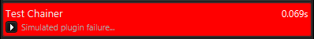

Plugin Reporter
---------------

How to open Plugin Reporter

.. csv-table::
   :header: "*CONSTELLATION Action*","*User Action*","*Menu Icon*"

   "Open Plugin Reporter","Views -> Plugin Reporter","|---resources-plugin-reporter.png|"

The Plugin Reporter stores a history of any plugin run on the graph currently in focus.

|resources-PluginReporter.png|

A plugin report will be created whenever a plugin is run, and added to the Plugin Reporter. These reports will change their color and message based on the current status of the plugin they represent.

|resources-PluginReportGreen.png|

|resources-PluginReportBlue.png|

|resources-PluginReportOrange.png|

|resources-PluginReportRed.png|

|resources-PluginReportGrey.png|

* *Green indicates the plugin is currently running.*
* *Blue indicates that the plugin was canceled.*
* *Orange indicates that an anticipated error occurred.*
* *Red indicates that an unexpected error occurred.*
* *Grey indicates that the plugin finished successfully.*

The Plugin Reporter allows filtering of the plugin history using a tag-based system. You can filter on plugin reports using by their tags using the 'Filter' drop down menu.

* *Analytic* Plugins which perform some analytic calculation based on information on the graph.
* *Import* Plugins which add information to the graph, generally these will be found in the Data Access View.
* *General* Plugins which don't fit into any specific category.
* *Low Level* Plugins which are generally hidden from the user.
* *Selection* Plugins which change what is selected on the graph.

The 'Clear' button will clear all currently displayed plugin reports, and only display new plugin reports for the active graph.

The 'Show All' button will make the Plugin Reporter display all plugin reports for the active graph.

The 'Help' button will open this help documentation.

.. |resources-PluginReportGreen.png| image:: resources-PluginReportGreen.png
   :width: 400px
   :height: 50px

.. |resources-PluginReportGrey.png| image:: resources-PluginReportGrey.png
   :width: 400px
   :height: 50px

.. help-id: au.gov.asd.tac.constellation.plugins.reporting
