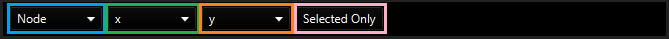
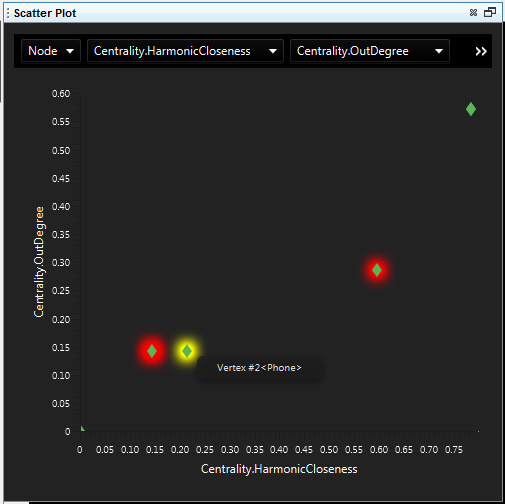
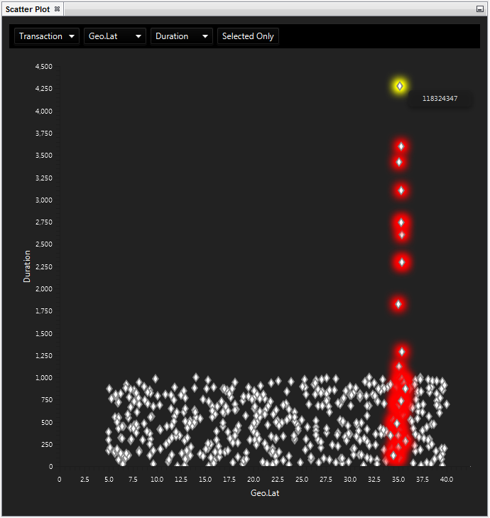

Scatter Plot
------------

How to open Scatter Plot

.. csv-table::
   :header: "*CONSTELLATION Action*","*User Action*","*Menu Icon*"

   "Open Scatter Plot","Views -> Scatter Plot","|---resources-scatter-plot.png|"

The Scatter Plot provides an interface for comparing numerical attributes in a graph with the intention of discovering patterns, or rather oddities within patterns in your graph.

The Scatter Plot is quite simple to use, you simply need to set values for the 4 options in the top toolbar.

|resources-ScatterPlotOptions.png|

* *Element Type:* This determines the element of the graph whose attributes you wish to plot.
* *X Attribute:* This is the attribute you wish to be drawn on the x axis of the scatter plot. This will only be populated with numerical attributes (being attributes with type boolean, integer, long, float or double).
* *Y Attribute:* This is the attribute you wish to be drawn on the y axis of the scatter plot. Likewise, this will only be populated with numerical attributes.
* *Selected Only:* This will toggle between drawing all values on the scatter plot, or only including values which belong to elements currently selected on the graph.

Upon selection of these options, the Scatter Plot will automatically generate an interactive plot for you. Selecting elements in your graph will also select the corresponding elements in the Scatter Plot and vice versa. Hovering over any element within the Scatter Plot will highlight it for you and display it's name within the graph.

If the Scatter Plot were set up with 'Nodes' set as the element type, 'Eigenvector Centrality' set as the x attribute, and the 'Katz Centrality' set as the y attribute...

|resources-ScatterPlotNodes.png|

For this particular graph, it seems that Harmonic Closeness and Out-Degree centrality measures have a polynomial relationship, where increasing the Harmonic Closeness centrality by n increases the Out-Degree centrality by some power of n. Notice there are some nodes highlighted red, indicating they are currently selected in the graph. You can also see the node the mouse cursor was hovering over, which is highlighted yellow and displaying the name of that node.

If the Scatter Plot were set up with 'Transactions' set as the element type, 'Latitude' set as the x attribute, and 'Event Duration' set as the y attribute...

|resources-ScatterPlotTransactions.png|

In this case, few events with particularly long durations which all seem to occur at the same latitude can clearly be seen, possibly indicating a single location where more time is allocated to the events being visualised in the graph.

.. help-id: au.gov.asd.tac.constellation.views.scatterplot
