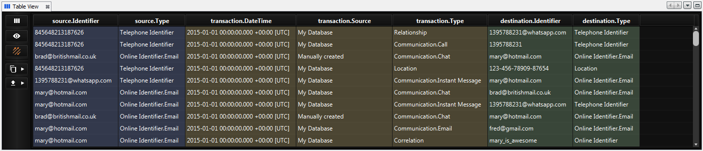
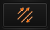
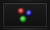
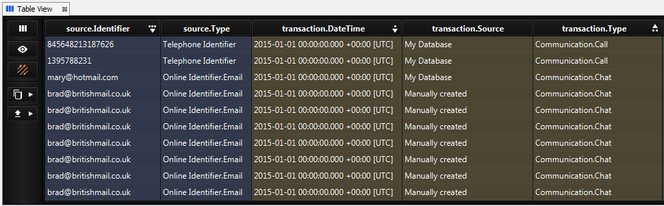
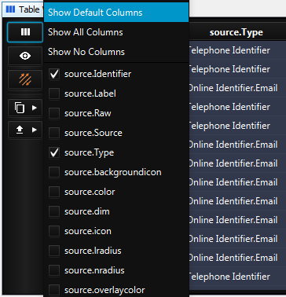
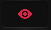
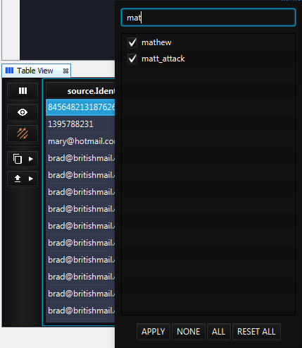
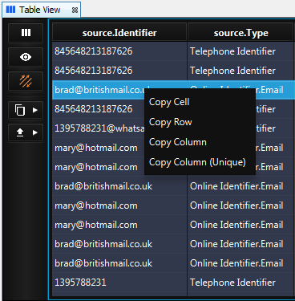
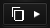
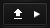

Table View 2
------------

How to open Table View

.. csv-table::
   :header: "*CONSTELLATION Action*","*User Action*","*Menu Icon*"

   "Open Table View","Views -> Table View","|---resources-table-view.png|"

The table view presents attribute data from the graph in a tabular format. Highlighted rows in the table represent selected elements in the graph. Selection of the table rows (including the use of the shift and control buttons) will result in the selection of the table rows and the associated elements in the graph itself. Conversely, changes to the graph selection are reflected in the table.

|resources-table-view.png| *The Table View.*

View
````

Element Type |resources-table-view-element-type-transactions.png| 
            <> |resources-table-view-element-type-nodes.png|
:::::::::::::::::::::::::::::::::::::::::::::::::::::::::::::::::::::::::::::::::::::::::::::::::::::::::::::::::::::::::::::::

Clicking the element type toolbar button will switch between tabular views of transaction data (which includes the nodes at either end), or node data.

Sort
````

Column Sorting
::::::::::::::

Left-clicking any column header will sort the table by the values in that column. A second click will reverse the sort order and a third click will remove the sort. If you hold shift while you click on column headers you can sort by multiple columns. This sorting will occur in the order that you click the columns (as indicated by the dots and numbers).

|resources-table-view-column-sorting.png|

Filter
``````

Column Visibility
:::::::::::::::::

Clicking the column visibility toolbar button will open a menu allowing you to customise which attributes are displayed in the table.

|resources-table-view-column-visibility.png|

Selected Only |resources-table-view-visibility-all.png| 
            <> |resources-table-view-visibility-selected-only.png|
:::::::::::::::::::::::::::::::::::::::::::::::::::::::::::::::::::::::::::::::::::::::::::::::::::::::::::::::::::::::::::

Clicking the selected only toolbar button will hide any elements which are not selected on the graph. Note that while this option is enabled, selection in the table will not update selection on the graph.

Column Filtering
::::::::::::::::

Right-clicking any column header will open a filter dialog allowing you to select / deselect values manually, or type something to apply a filter to the data.

|resources-table-view-column-filtering.png|

Export
``````

Context Menu
::::::::::::

Right-clicking anywhere on the table will open a context menu providing options to copy data from the clicked cell, row or column.

|resources-table-view-context-menu.png|

Copy Table |resources-table-view-copy.png|
::::::::::::::::::::::::::::::::::::::::::

Clicking on the copy toolbar button will provide you with options to copy the table to the system clipboard. The table will be copied exactly as it appears in the Table View.

Export Table |resources-table-view-export.png|
::::::::::::::::::::::::::::::::::::::::::::::

Clicking on the export toolbar button will provide you with options to export the table in various file formats. The table will be copied exactly as it appears in the Table View.

.. |---resources-table-view.png| image:: ---resources-table-view.png
   :width: 16px
   :height: 16px























.. help-id: au.gov.asd.tac.constellation.views.tableview2
