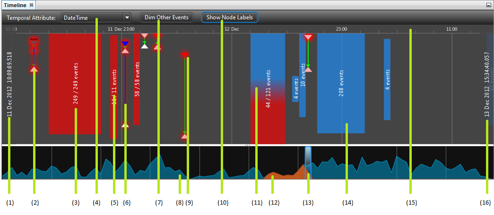
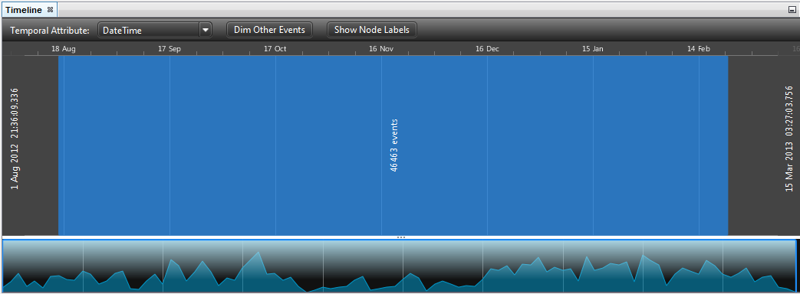
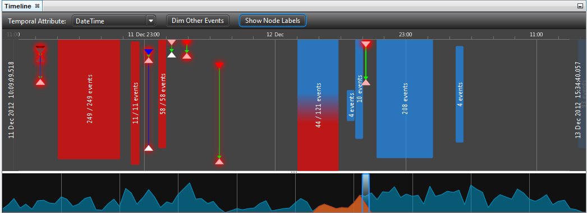
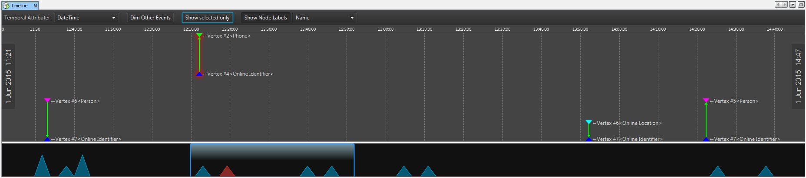

Using the Timeline
------------------

If the graph that you are currently analysing contains temporal data on its transactions, it can be viewed using the Timeline View. The Timeline will plot the data from the graph relative to its occurrence in time. There are several major visual tools used to describe the data from the graph. These include:

* Temporal Clusters;
* Events (composed of a transaction, and two nodes);
* Overview panel; and,
* Node labels

Major Components of the Timeline View
-------------------------------------

* Starting time of the Timeline.
* Node (from an event).
* Temporal cluster, with all events selected on the graph.
* The temporal attribute being displayed on the Timeline.
* The total number of events represented by the Timeline.
* Transaction (from an event).
* Dims events that are not currently shown in the Timeline Window.
* The Overview Panel shows the distribution of events over the full extent of the temporal data.
* The glow represents that a node or selection is selected on the graph.
* Shows labels for each node for a given attribute type. (See below for further information.)
* The gradient represents the percentage of the temporal cluster that is currently selected. Red indicates selected events, and blue unselected.
* The red section of the Overview Panel indicates selected events.
* The point of view rectangle indicates the period of time being viewed in the Timeline above.
* An example of a cluster with no selected events.
* The time axis. The labels indicate the time events have occurred. They are updated to reflect the current zoom on the Timeline, and range from 'millis' to 'decades'.

Temporal Clusters
`````````````````

In the image above, the blue rectangle represents more than 43 000 distinct events. At the current zoom level on the Timeline, these events overlap, and have thus been grouped into a temporal cluster. This helps keep the interface clear, and provides an insight into the number of events occurring over a given time period.

If the Timeline is zoomed in, this large temporal cluster will 'break' into smaller temporal clusters and potentially distinct events. (This effect can be seen in the image below.)

Events
``````

In this image, distinct events can be seen. They are shown as (from top to bottom):

* Node (Represented as a triangle;
* Transaction (which can be directed, shown as an arrow, or undirected, shown only as a line); and,
* Node.

If any of the elements (nodes or transaction) are selected on the graph, they will be shown with a red 'glow'. Clicking on any of these elements will select it on the graph, and if the 'Control' button is pressed while a selection is performed, it will be added to the currently selected elements on the graph.

Node Labels
```````````

If the 'Show Node Labels' toggle button is pressed and a node attribute selected as above, then labels will be shown next to nodes where there is data present. This can be useful for quickly identifying nodes, or showing an interesting attribute. In the image above, the 'Name' attribute has been selected.

Navigating the Timeline View
----------------------------

Timeline Window
```````````````

Dragging
::::::::

If the middle button or the secondary button on the mouse is pressed and held above the Timeline, and the mouse dragged, the Timeline Window will refresh the beginning and end times relative to the movement of the mouse.

Zooming
:::::::

If the mouse wheel is scrolled, the Timeline Window will increase or decrease the amount of time covered by the Timeline Window relative to the scroll direction.

Selecting a Time Range
::::::::::::::::::::::

Clicking on the Timeline window with the primary mouse button and dragging will cause a selection rectangle to be created. Any events under the selection rectangle upon release will be selected on the graph.

Overview Panel
``````````````

Dragging the Point Of View Rectangle
::::::::::::::::::::::::::::::::::::

If the primary mouse button is clicked and dragged over the point of view rectangle of the Overview Panel, the time period shown by the Timeline Window updates to reflect the position of the point of view rectangle.

Resizing the Point Of View Rectangle
::::::::::::::::::::::::::::::::::::

If the primary mouse button is clicked and dragged at the edges of the point of view rectangle, the time period shown by the Timeline Window updates to reflect the position of the point of view rectangle.

Resizing the Overview Panel
:::::::::::::::::::::::::::

The Overview Panel can be resized by clicking and dragging the '...' button on the slider.










.. help-id: au.gov.asd.tac.constellation.views.timeline
